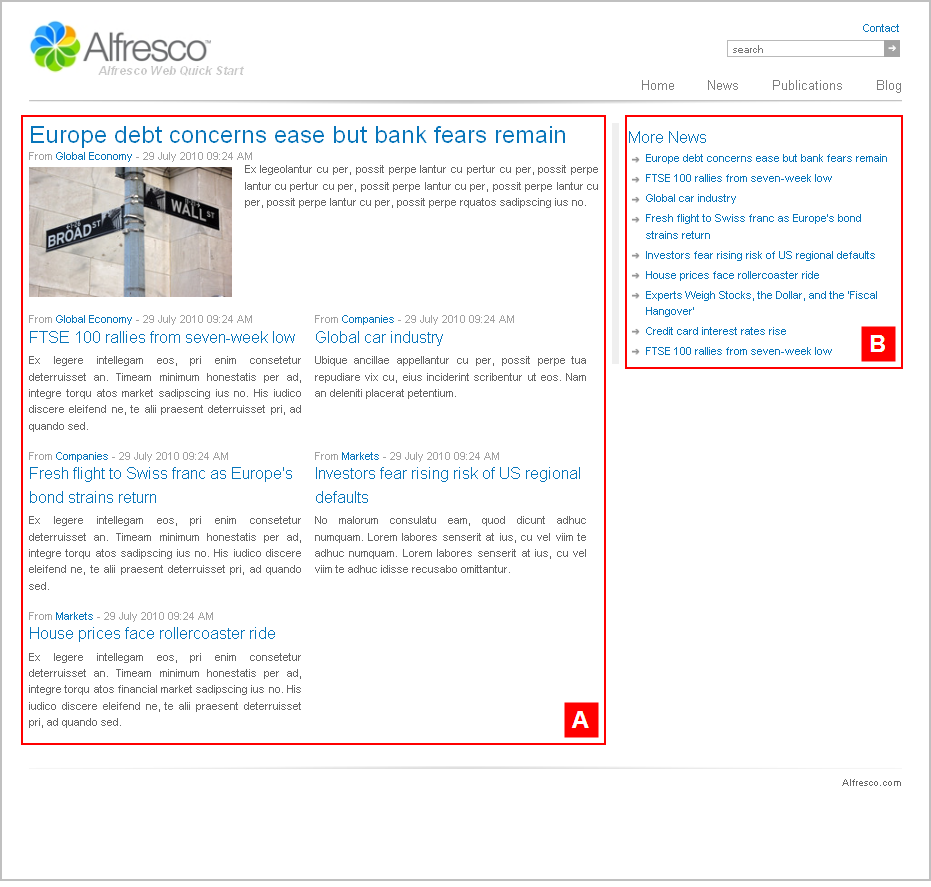

# sectionpage1

The section **Alfresco Quick Start \> Quick Start Editorial \> root \> news** has the template mapping `ws:indexPage=sectionpage1`.

This is a section landing page template that features a two column article list and a list of related content. This template page has a two column layout.

View the News landing page on the Web Quick Start website to see a rendering of the `sectionpage1` template.

|A|Component: `/list/twocolumn`This component displays a single article with a medium thumbnail to the left and a two column list beneath.

The content is populated from:

**Quick Start Editorial \> root \> news \> collections \> featured.articles**This is a static asset collection.

|
|B|Component: `/related/related`This component displays a list of related articles.

The content is populated from:

**Quick Start Editorial \> root \> news \> collections \> section.articles**This is a dynamic asset collection.

|

**Parent topic:**[Templates](../references/qs-ref-templates.md)

