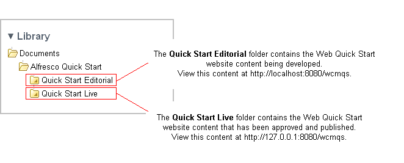

# Alfresco Quick Start folders

The Quick Start demo site in Share is separated into two main folders: **Quick Start Editorial** and **Quick Start Live**. This folder structure provides a separation between the content that is being authored by the editorial team and the finished, reviewed, and published content that is visible on the live website.

This top-level structure is the same in all examples—Finance, Government, and Education— of the Web Quick Start site.

The default configuration sets the host address to 127.0.0.1, so if you are running the Quick Start demo locally, you can view the editorial environment on http://localhost:8080/wcmqs and the live environment on http://127.0.0.1:8080/wcmqs.

If you are not running the Quick Start demo locally, then you must change the host name and port for the website in order to view it. The folders **Quick Start Editorial** and **Quick Start Live** hold the configuration for the editorial and live versions of the website respectively. Use the **Edit Metadata** action to edit this configuration.

**Parent topic:**[Breaking down the Web Quick Start site structure](../references/qs-ref-anatomy.md)

