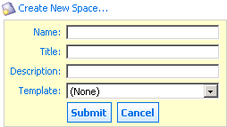

# Creating a new space

Create a new space in the Alfresco repository directly from Word.

1.  On the Browse Spaces and Documents tab of the Alfresco panel, browse to the space in which you want to create the new space.

2.  Click **Create New Space...** at the top of the subspaces list.

    

    A form displays where you enter the details of the space being created.

3.  Specify the **Name**, **Title**, **Description**, and **Template** you want to use for the new space.

4.  Click **Submit**.

    The new space displays in the subspaces list.

**Parent topic:**[Working with spaces](../concepts/MSAddin-spaces.md)

**Related information**  

[Browsing spaces](MSAddin-browse-spaces.md)

