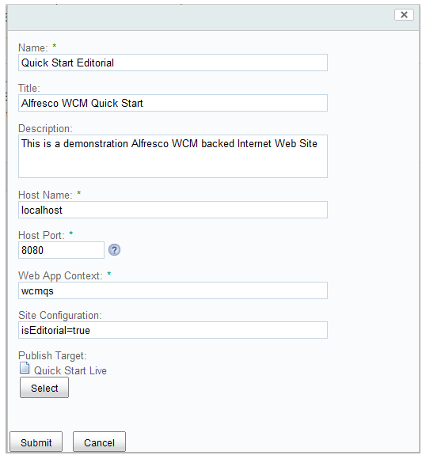

# Disabling AWE on the Live environment

The Web Editor \(AWE\) is configured to be enabled on the Editorial content, and disabled on the Live. This is controlled by the `isEditorial` flag on the **Quick Start Editorial** metadata. This also \(when complete\) dictates what can be viewed via the live web application with regards to publishing go live and expiry dates.

This procedure configures the web application to view the “Live” site structure.

1.  Edit the metadata properties on the **Quick Start Live** folder.

2.  In the **Site Configuration** field, enter the `isEditorial=true` flag.

    

3.  Click **Submit**.

The default configuration sets the host address to 127.0.0.1, so if you are running Web Quick Start locally, you can view the editorial environment on [http://localhost:8080/wcmqs](http://localhost:8080/wcmqs) and the live on [http://127.0.0.1:8080/wcmqs](http://127.0.0.1:8080/wcmqs).

**Parent topic:**[Configuring Web Quick Start](../tasks/WQS-config.md)

