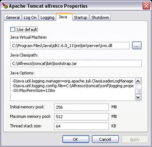

# Configuring Alfresco as a Windows service

This section describes how to configure Alfresco as a Windows service in a standard Tomcat installation. To configure Alfresco to run as a Windows service, you need to set up the application server \(Tomcat\) to run as a Windows service.

Before you start, Alfresco and JDK 6 must be installed on your system.

1.  Open a command prompt.

2.  To install Alfresco as a Windows service, enter the following commands:

    **Note:** It is important to use the full path. The commands in this task assume an Alfresco installation at c:\\alfresco.

    For Tomcat 6:

    ```
    cd c:\alfresco\tomcat\bin 
    service.bat install alfresco 
    tomcat6 //IS//Tomcat6 --DisplayName="Alfresco Server" \
    --Install="C:\Program Files\Tomcat\bin\tomcat6.exe" --Jvm=auto \
    --StartMode=jvm --StopMode=jvm \
    --StartClass=org.apache.catalina.startup.Bootstrap --StartParams=start \
    --StopClass=org.apache.catalina.startup.Bootstrap --StopParams=stop
    ```

3.  To edit your service settings, enter the following commands:

    For Tomcat 6:

    ```
    cd c:\alfresco\tomcat\bin 
    tomcat6w.exe //ES//alfresco 
    ```

    

4.  Locate the service named Alfresco Server in the Services panel.

5.  Start the Alfresco Server service.


You can uninstall the service using the following commands:

```
cd c:\alfresco\tomcat\bin 
service.bat uninstall alfresco
```

**Parent topic:**[Installing Alfresco on Tomcat](../tasks/alfv3-tomcat-install.md)

