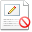
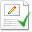
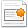

# Customizing the interface

On your web page, action icons \(**Edit**, **Create Article**, and **Delete**: \) mark each block of editable content. You can choose to hide or show these content markers.

By default, the content markers are displayed.

-   On the Web Editor toolbar, click **Toggle Edit Markers** to turn the content markers on and off. This button has two states:

    -    indicates the content markers are displayed. Click this button to hide the markers.
    -    indicates the content markers are hidden. Click this button to display the markers.
    When the content markers are hidden, the menus on the toolbar provide access to the in-context editing features. Use the **Quick Edit** menu, , to select the content you want to edit; use the **Quick Create** menu, , to create content.

    The content markers must be visible to perform the **Delete** action.

**Parent topic:**[Alfresco Web Editor](../concepts/awe-introduction.md)

