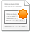

# Creating web content

The **Create Article** feature enables you to quickly and conveniently create website content without having to open Share.

The content item created with this action has the same type as the content that is currently displayed on the web page.

1.  Expand the **Quick Create** menu \(\) on the Alfresco Web Editor toolbar and click **Create Article**.

    **Fastpath:** In addition to selecting from the menu, you can simply click the **Create Article** icon on the web page.

    If you are not already logged in, you will be prompted for your Alfresco login details. Enter your username and password, then click **Login** to continue. This enables the **Logout** feature on the application toolbar.

    The **Create Article** page opens.

2.  Enter the desired metadata and content.

    **Note:** The **Name** is the filename for the content item in the Share document library. This field does not support the following special characters: \* < \> \\ / . ? : and \|. When the name contains a disallowed character, the **Submit** button is disabled.

    Give careful consideration to the **Title** and **Description** entries as this information often appears on the web page.

    In the **Content** box, use the features provided to format the text. Position the cursor over an icon to display its function. Click and drag the bottom right corner to resize the text editor.

3.  Click **Submit**.

    The content item is created in the Share document library in the same location \(folder\) as the currently displayed web page content.

**Parent topic:**[Alfresco Web Editor](../concepts/awe-introduction.md)

