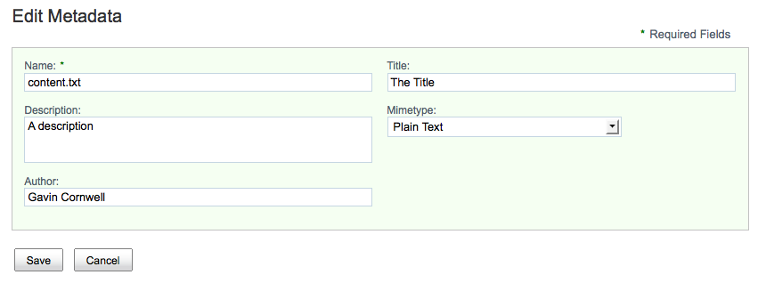

# Providing a custom form template

The default template that renders the form UI generates one column of fields. There are scenarios where more control may be required over the layout. To enable these scenarios, it is possible to replace the default template with a custom template. A different template can be provided for each form mode.

Store the custom templates in the site-webscripts directory, which is usually be in the application server shared classpath.

1.  The example below shows the **Edit** form for the standard `cm:content` type being configured to render with two columns of fields.

    ```
    <config evaluator="node-type" condition="cm:content">
       <forms>
          <form>
                <edit-form template="/2-column-edit-form.ftl" />
          </form>
       </forms>
    </config>
    
    ```

    The example template 2-column-edit-form.ftl is available in the distribution in the samples folder.

    The following example shows the contents of the 2-column-edit-form.ftl file. It uses some of the Freemarker macros available in form.lib.ftl but supplies its own `renderSetWithColumns` macro to render the HTML required to create the grid using the YUI grid CSS capabilities.

    ```
    <#import "/org/alfresco/components/form/form.lib.ftl" as formLib />
    
    <#if error?exists>
       <div class="error">${error}</div>
    <#elseif form?exists>
    
       <#assign formId=args.htmlid + "-form">
       <#assign formUI><#if args.formUI??>${args.formUI}<#else>true</#if></#assign>
    
       <#if formUI == "true">
          <@formLib.renderFormsRuntime formId=formId />
       </#if>
       
       <div id="${formId}-container" class="form-container">
          
          <#if form.showCaption?exists && form.showCaption>
             <div id="${formId}-caption" class="caption"><span class="mandatory-indicator">*</span>${msg("form.required.fields")}</div>
          </#if>
             
          <#if form.mode != "view">
             <form id="${formId}" method="${form.method}" accept-charset="utf-8" enctype="${form.enctype}" action="${form.submissionUrl}">
          </#if>
          
          <div id="${formId}-fields" class="form-fields"> 
            <#list form.items as item>
                <#if item.kind == "set">
                   <@renderSetWithColumns set=item />
                <#else>
                   <@formLib.renderField field=item />
                </#if>
             </#list>
          </div>
             
          <#if form.mode != "view">
             <@formLib.renderFormButtons formId=formId />
             </form>
          </#if>
    
       </div>
    </#if>
    
    <#macro renderSetWithColumns set>
       <#if set.appearance?exists>
          <#if set.appearance == "fieldset">
             <fieldset><legend>${set.label}</legend>
          <#elseif set.appearance == "panel">
             <div class="form-panel">
                <div class="form-panel-heading">${set.label}</div>
                <div class="form-panel-body">
          </#if>
       </#if>
       
       <#list set.children as item>
          <#if item.kind == "set">
             <@renderSetWithColumns set=item />
          <#else>
             <#if (item_index % 2) == 0>
             <div class="yui-g"><div class="yui-u first">
             <#else>
             <div class="yui-u">
             </#if>
             <@formLib.renderField field=item />
             </div>
             <#if ((item_index % 2) != 0) || !item_has_next></div></#if>
          </#if>
       </#list>
       
       <#if set.appearance?exists>
          <#if set.appearance == "fieldset">
             </fieldset>
          <#elseif set.appearance == "panel">
                </div>
             </div>
          </#if>
       </#if>
    </#macro>
    ```

2.  When the configuration and template is in place, the Edit Metadata page for a `cm:content` type in Share has the following appearance.

    


**Parent topic:**[Forms](../concepts/forms-intro.md)

