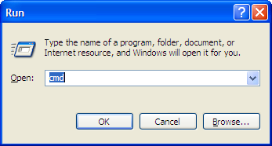
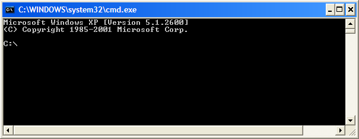

# Opening a Windows command prompt

You may need to run and edit scripts in a command prompt when installing on a Windows-based system.

1.  On the Windows task bar, click **Start \> Run**.

2.  In the **Run** dialog box, type cmd.

    

3.  Click **OK**.

    The Run dialog box closes and a command prompt opens.

    

**Parent topic:**[Frequently occurring tasks](../concepts/fot.md)

