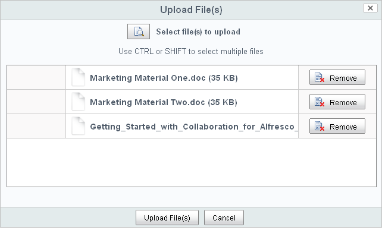

# Add marketing material

You have been preparing for this site for a month now and have three pieces of marketing content that you would like to upload. For this step of the scenario, choose three pieces of content on your personal computer to add to the library.

1.  Within your site, click **Document Library** on the banner.

    The Document Library page component opens.

2.  Click **Upload** to load your three content items.

    The **Upload File\(s\)** page opens.

3.  Click the browse button to locate any three pieces of content on your computer to upload.

    The **Upload File\(s\)** page displays the three content items as a list.

    

4.  Click **Upload File\(s\)**.

    The content items display their upload status.

5.  Click **OK** when all content is 100% complete.

The page closes and the Document Library displays the selected content items.

-   **[Update a document](../tasks/gs-content-update.md)**  
After uploading the marketing material, you realize that one document contains an error.

**Parent topic:**[Prepare your site for collaboration](../concepts/gs-site-prepare.md)

