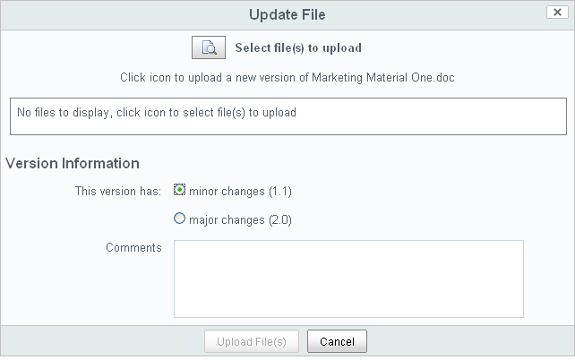

# Update a document

After uploading the marketing material, you realize that one document contains an error.

1.  In the Document Library item list, position your cursor over one of the content items you have uploaded.

    This highlights the item and displays the actions available for that item.

2.  Click **More** and then select the **Edit Offline** action.

    The content moves to the **I’m Editing** view, indicating that the document is checked out to you.

3.  Choose to save the file and click **OK** to save the content item in a location from which you can edit it.

    The content name will be appended with **\(Working Copy\)** in the location in which you save it.

4.  Navigate to this content item on your personal computer, change a word, and save it.

5.  In the browsing pane of the Document Library, ensure **I’m Editing** is the selected view under **Documents**.

6.  In the item list, locate the document you modified and click the **Upload New Version** action.

    The Update File page displays.

    

7.  Click the browse icon to locate and select your modified file.

    Remember that it is appended with **\(Working Copy\)**.

    Once selected, it displays in the Update File page.

8.  Specify whether it is a minor or major version, type any comments you have, and click **Upload File\(s\)**.

9.  Click **OK** when the upload reaches 100%.

You can locate the updated content item in its original location, the **Documents** folder, in the library. The version number has been updated accordingly.

**Parent topic:**[Add marketing material](../tasks/gs-content-add.md)

