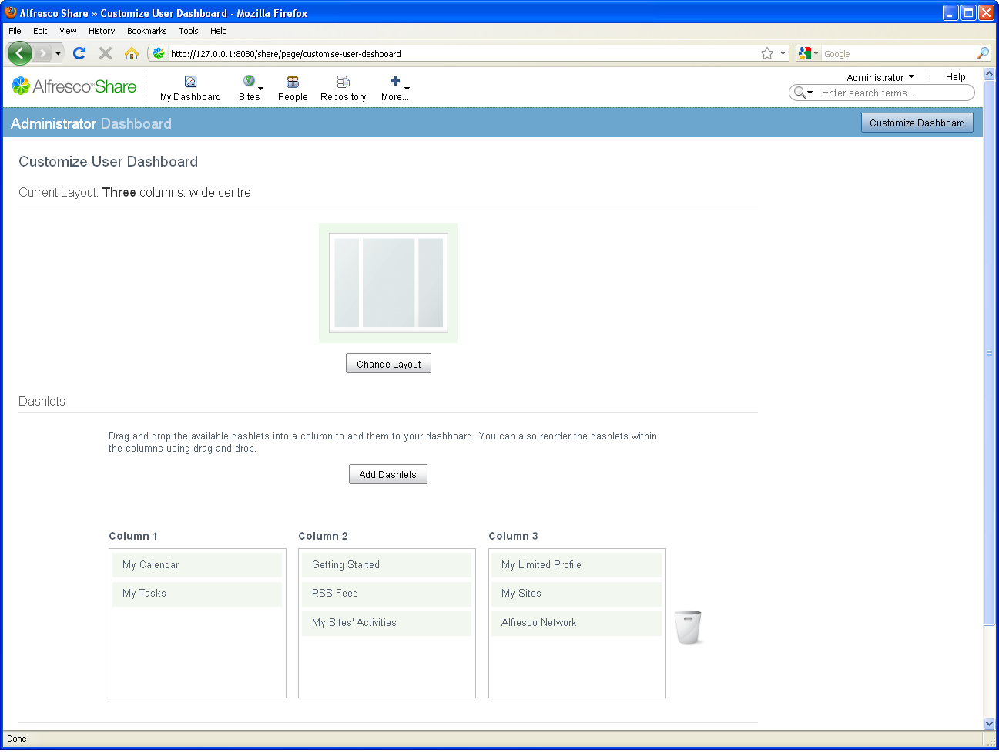
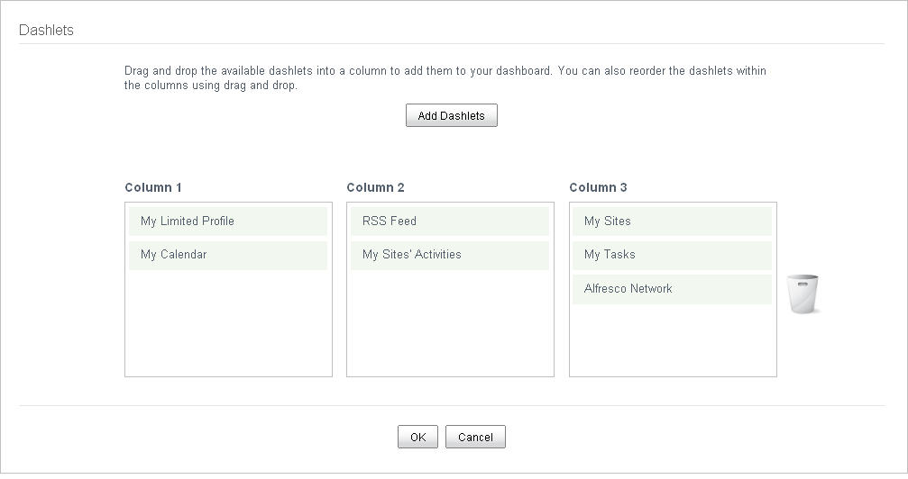

# Set up your personal dashboard

You can set up your personal dashboard to tailor the view you have, depending on your requirements.

You can:

-   Modify the dashboard appearance – view as one, two, three, or four columns
-   Add and remove personal dashlets

**To modify the dashboard appearance and content:**

1.  Click **Customize Dashboard** on the banner.

    

    The Customize User Dashboard page displays.

2.  Click **Change Layout** to display the available layouts.

3.  Click the graphic or **Select** for the desired layout. For this scenario, there is no need to modify anything.

4.  Click **Cancel**.

5.  Click **Add Dashlets**.

    All available dashlets display.

6.  Click and drag **Getting Started** to the trash can to remove it.

7.  Use standard drag and drop functionality to move:

    1.  **My Limited Profile** to the top of the left column

    2.  **My Tasks** to the middle of the right column

    

8.  Click **OK**.

The configuration is saved and you return to your updated personal dashboard.

**Parent topic:**[Log in](../tasks/gs-login.md)

