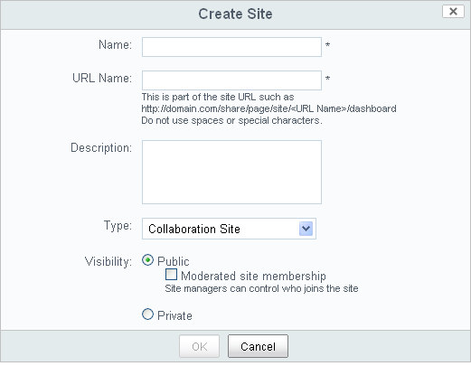
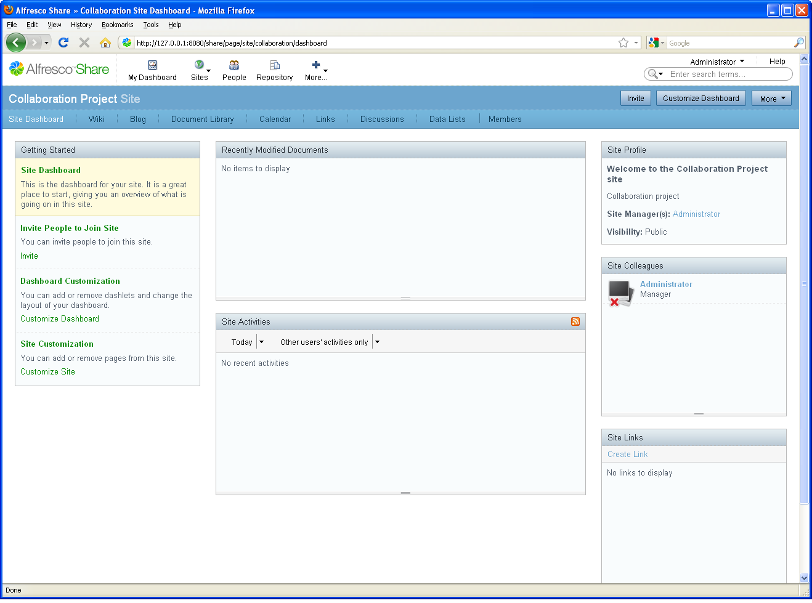

# Create your collaboration site

The next step in the scenario is to create a collaboration site for your team.

From here, your team will be able to:

-   Share and manage content
-   Schedule and manage meeting events
-   Have group discussions
-   Write blogs
-   Author content online and share with others via a wiki

**To create your site:**

1.  On the application toolbar, click **My Dashboard** to return to your personal dashboard.

2.  Click **Create Site** on the My Sites personal dashlet.

    

3.  Add the following information:

    1.  **Name:** A descriptive name that will display as the title of your site. This is mandatory.

    2.  **URL name:** A brief version of the name that is appropriate for a URL; it cannot contain any spaces or special characters. This is mandatory.

    3.  **Description:** Information to distinguish your site from others in the My Sites list.

    4.  **Type:** For this release, the only available site type is **Collaboration**.

    5.  **Visibility:** A value that dictates users' access to the site.

    **Note:** Your site has public access by default, meaning it is available to be viewed by all users, whether or not they join the site. In a private site, the Site Manager invites users to join. In a moderated public site, the Site Manager controls the membership by accepting or rejecting membership requests.

4.  Click **OK** to create and view your new site.

    

-   **[Set up your site](../concepts/gs-site-setup.md)**  
The site dashboard displays all information and activities associated with the site. It is customized by the site owner.

**Parent topic:**[Getting Started with Alfresco Share Collaboration](../concepts/gs-intro.md)

