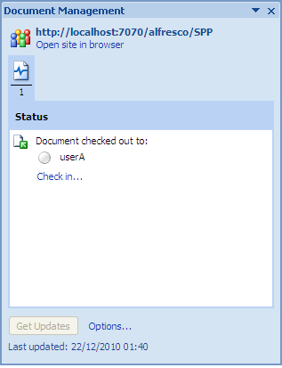

# Check out the document

Checking out a document to edit it locks the file to all other users while you make your changes. Members of the Document Workspace can still view and download the original version of the document while you have it checked out.

To check out local.docx from the Document Workspace:

1.  Click the Microsoft Office button and select **Server**, then **Check Out**.

    A message informs you that the document will be stored in the **SharePoint Drafts** folder, which will be created automatically.

2.  Click **OK**.

    On the Status tab of the task pane, the **Check in** link appears, indicating the document is now checked out to you.

    

3.  \(Optional\) To verify the check-out in Share:

    1.  Open Share in any browser \(http://Share URL:8080\>/share/\) and log in as User A \(userA, userA\).

    2.  Click the site name, **SPP**, on your My Sites dashlet.

    3.  Click **Document Library**.

        The library item list displays a message for the item local.docx indicating that the document is locked by you for offline editing.

    4.  Log out of Share and close the browser.

**Parent topic:**[Edit a Document Workspace document](../tasks/gs-spp-doc-edit.md)

