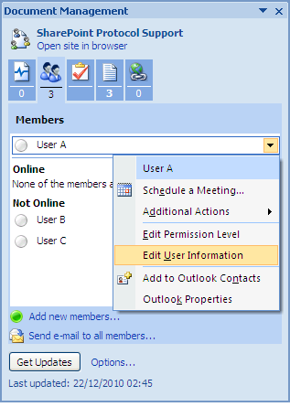

# View and edit user profiles

You can view your own profile and the profiles of all other site members. However, you can only edit and change the password for your own profile.

To edit your own profile and view another member’s profile:

1.  On the Document Management task pane of the document spp-tutorial.docx, position your cursor over **User A**, open the menu that becomes active, and select **Edit User Information**.

    

    **Note:** If prompted, log in to Share as User A \(userA, userA\).

    Share opens. The User Profile page component displays your user details \(User A\). From here you can change your password and edit your profile, though you do not need to perform either task for the purpose of this tutorial. For details on performing these tasks, refer to the Share user help.

2.  Log out of Share and close the browser.

**Parent topic:**[Manage the Document Workspace membership](../concepts/gs-spp-members-manage.md)

