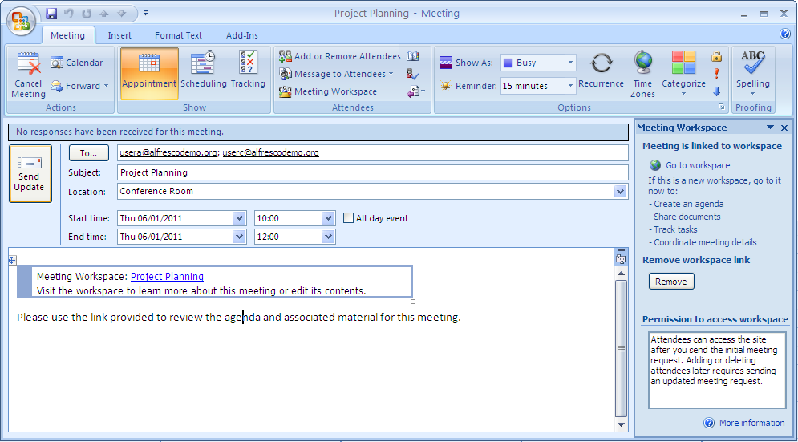

# Edit the meeting attendees

In Outlook, you can easily change the users invited to a meeting and then send an update. When a meeting is associated with a Meeting Workspace, changing the users automatically updates the members of the related workspace in Share.

To add and remove meeting attendees:

1.  On the Calendar view in Outlook, locate your meeting.

2.  Right-click and select **Add or Remove Attendees**.

3.  In the **Required** field, remove userb@alfrescodemo.org.

4.  Add userc@alfrescodemo.org and click **OK**.

    The **To** field displays the updated attendees list.

    

5.  Click **Send Update**.

6.  At the prompt, choose to send an update only to the attendees affected by the change and click **OK**.

7.  \(Optional\) To verify that the attendee list has been updated in the Meeting Workspace:

    1.  Right-click the meeting on your Outlook calendar and select **View Meeting Workspace**.

    2.  When prompted, log in as the administrator \(admin, admin\).

    3.  Click **Members** on the banner to display the Search for Site Members page.

    4.  Click **Search** to view the current members.

        The page displays the updated members: Administrator, User A, and User C.

    5.  Log out of Share and close the browser.

**Parent topic:**[Collaborate with colleagues around a meeting](../concepts/gs-spp-mtgworkspace-intro.md)

