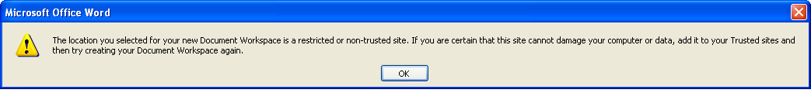

# Create a Document Workspace

To perform these document management tasks, you need to start with a Document Workspace containing a single document. A Document Workspace is simply a particular type of Alfresco Share site. You can create this within Word.

To create a Document Workspace from Word:

1.  Open Word, create a new document, and enter some text.

2.  Save this document on the desktop as local.docx.

3.  Click the Microsoft Office button and select **Publish**, then **Create Document Workspace**.

    The Document Management task pane opens in Word to the right of the document. The Document Workspace name defaults to **local**, the name of your document.

4.  Change the default entry in the **Document Workspace name** field to SPP.

    **Note:** When creating a site, all non-alphanumeric characters in the **Document Workspace name** field, including spaces, are converted to underscores for both the Share site name and the URL name.

5.  In the **Location for new workspace** field, type http://<Alfresco server URL:7070\>/alfresco.

    For example, http://alfrescoserver:7070/alfresco.

    

6.  Click **Create**.

    If you have not set up your Alfresco server as a trusted site, you receive the following message.

    

    If the message appears, add the Alfresco server location to Internet Explorer’s list of trusted sites, then return to Word and click **Create** again.

7.  When prompted for login credentials, log in as User A: type userA for both the user name and password, then click **OK**.

    **Important:** Do not check **Remember my password** as you will be changing users later in the tutorial.

    Word creates the Document Workspace \(Share site\), adds to this the document local.docx on your desktop, and displays the Document Management task pane. Office may prompt you to log in again. If so, use the same user name and password.

8.  \(Optional\) To verify that the new site has been created in Share:

    1.  Open Share in any browser \(http://<Alfresco Share URL:8080\>/share/\) and log in as User A \(userA, userA\).

        The My Sites dashlet on your personal dashboard lists the SPP site.

    2.  Click the site name, **SPP**, to navigate to the SPP site dashboard.

        The Recently Modified Documents dashlet indicates that this site’s document library contains the document local.docx.

    3.  Log out of Share and close the browser.

9.  In Word, close the document local.docx.

**Parent topic:**[Manage a document](../concepts/gs-spp-doc-manage.md)

