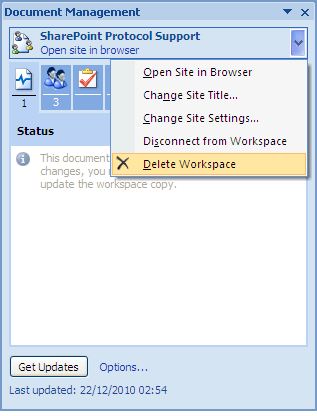

# Delete the Document Workspace

Once you complete the collaboration on the document you typically delete the Document Workspace as it is no longer required. This action permanently deletes the site and all of its contents.

With the tutorial now complete, you can perform this task to remove the sample site, SharePoint Protocol Support, and its contents from Share. Ensure the document local.doc is open.

1.  On the Document Management task pane, position your cursor over the site name: **SharePoint Protocol Support**.

2.  Open the menu that becomes active and select **Delete Workspace**.

    

    A message prompts you to confirm the deletion.

3.  Click **Yes** to delete the site and its contents.

    The site is removed.

**Parent topic:**[Collaborate with colleagues on a document](../concepts/gs-spp-collaborate.md)

