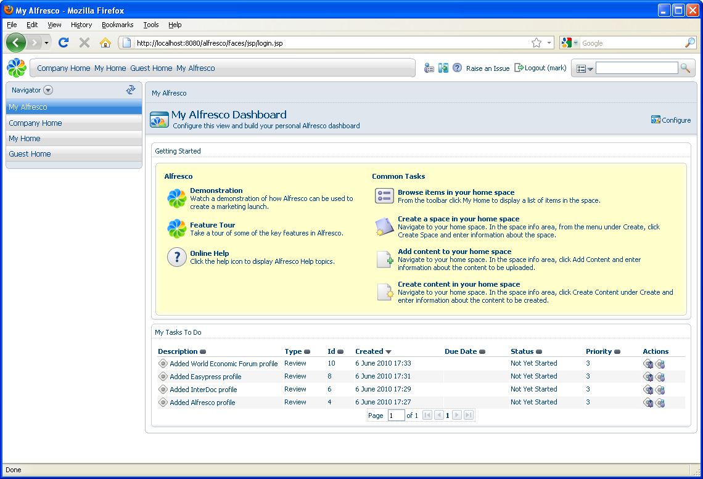
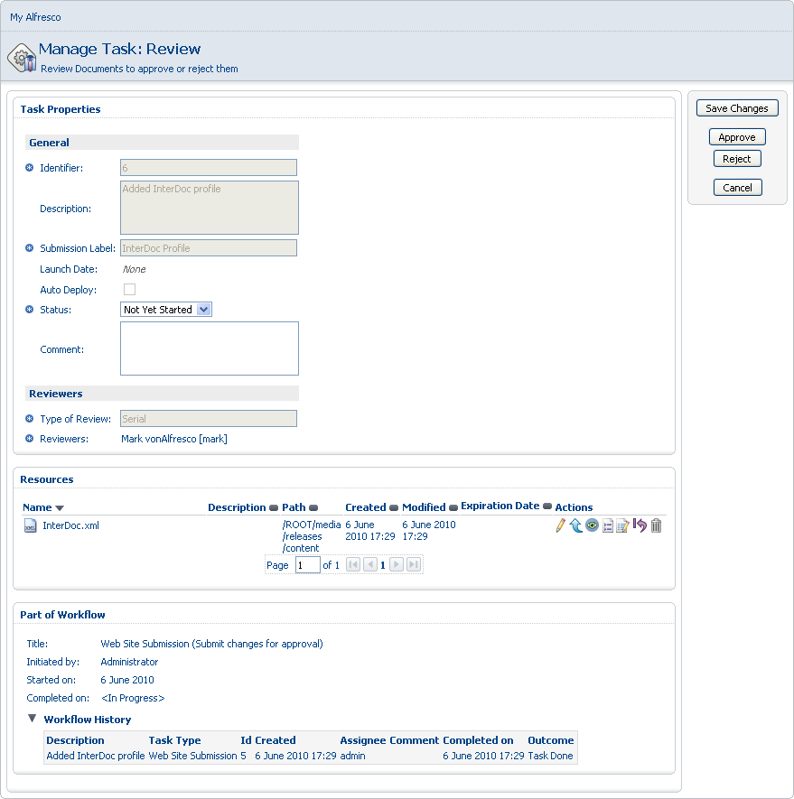
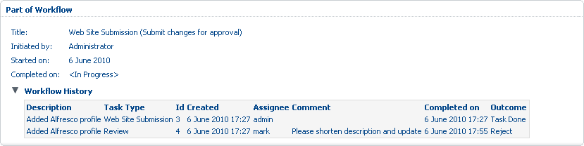
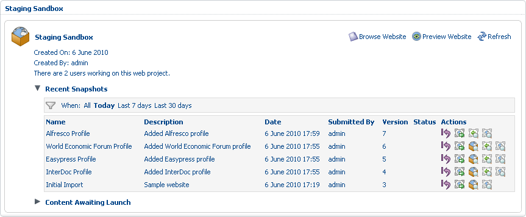

# Approve content

With all of your web project content created, you can now address the items assigned for editorial review as part of the defined workflow.

1.  Log out as the administrative user and log in as Mark, the Content Manager \(mark, demo\).

    In the **My Tasks To Do** list on Mark's dashboard, notice the four outstanding review tasks, one for each of the company profiles you created.

    

2.  For the Interdoc profile, click **Added Interdoc profile** to open the **Manage Task: Review** page.

    

3.  Click **Approve**.

4.  Approve the **Added Easypress profile** and **Added World Economic Forum profile** tasks in the same manner.

    For the Alfresco profile, you can work through the process of rejecting and resubmitting an item for approval.

5.  Open the **Added Alfresco profile** task and type Please shorten description and update. Click **Reject**.

    Once rejected, the serial workflow defined reassigns the item as a task to the user who originally submitted it—in this case, the administrative user.

6.  Log out as Mark and log in as the administrator \(admin, admin\).

7.  Open the task in the administrator’s **My Tasks To Do** list and note the comment in the **Workflow History** list.

    

8.  After reviewing the changes Mark requires in order to approve the content, click the **Edit** action \(\) for Alfresco.xml in the **Resources** section to open the Edit Web Content Wizard.

9.  In the **Body** text editor box, remove the last sentence and click **Next**.

    Notice on the **Summary** page that the option to auto-submit upon completion is not present, as the content has already been submitted.

10. Click **Finish**. In the **Comment** box, type Removed last sentence and updated, then click **Resubmit for Review**.

11. Log out as the administrator and log in as Mark again.

    In Mark's task list, notice the **\(2\)** next to the task description. This number represents the current review cycle for this content submission.

12. Open and approve the task to promote the item to staging.

13. Log out as Mark and log in as the administrator one last time.

14. Within the **alfrescosample** project, expand the **Recent Snapshots** list in the Staging Sandbox.

    

    This final promotion to staging releases the lock on the item and creates a new snapshot in the Staging Sandbox.

    All four company profiles are complete and submitted to staging.

**Parent topic:**[Manage web project content](../concepts/gs-wcm-manage-content.md)

