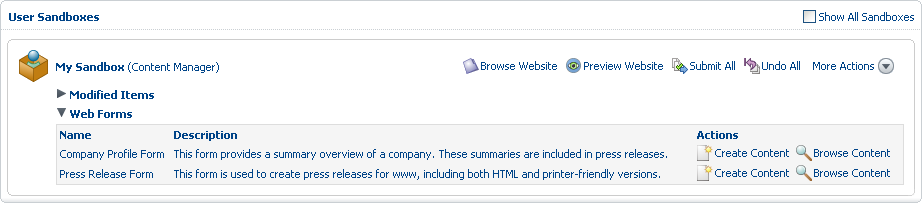
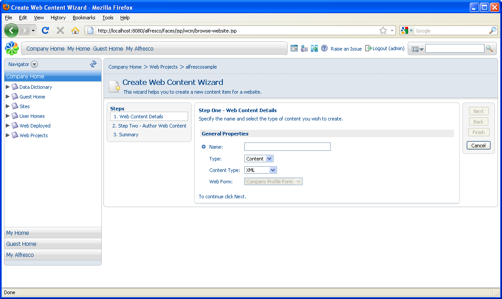
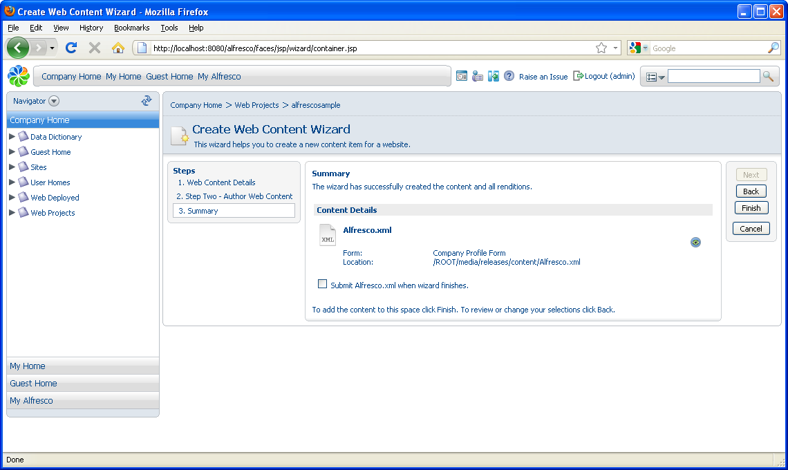
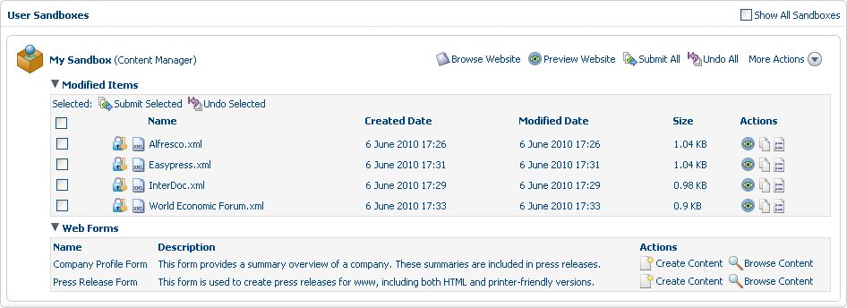

# Create web content: Company Profiles

In this task, you will use one of your web forms to create four new content items, each one a company profile.

1.  In your user sandbox, expand the **Web Forms** list, which contains the two web forms you created: **Company Profile Form** and **Press Release Form**.

    

2.  Select the action **Create Content** associated with the **Company Profile Form** web form.

    

    The Create Web Content Wizard opens.

3.  Complete each page of the wizard as follows, clicking **Next** to move to the next step.

    1.  Step One - Web Content Details

        Enter Alfresco as the **Name**.

    2.  Step Two – Author Web Content

        Use the following information to complete the page:

        -   **Name**

            Alfresco

        -   **Body**

            Alfresco is the leading open source alternative for enterprise content management. It is the first company to bring the power of open source to the enterprise content management market, enabling unprecedented scale and a much lower total cost of ownership than proprietary systems. Founded by a team of content management veterans that includes the co-founder of Documentum, John Newton, and former COO of Business Objects, John Powell, Alfresco is based in London. For more information, visit [www.alfresco.com](http://www.alfresco.com).

    3.  Summary

        Review the summary screen, which should look like the following:

        

        Note that you are creating the content item Alfresco.xml to be stored in the location /ROOT/media/releases/content, which was specified when you created the Company Profile Form web form.

        As we no longer need to work on this asset, select the option to **Submit Alfresco.xml when wizard finishes** to speed up publication. This saves you from initiating a separate submission process.

4.  Click **Finish**.

    The **Submit Items** page appears where you enter the following details regarding the submission:

    -   **Label**

        Alfresco Profile

    -   **Description**

        Added Alfresco profile

5.  Click **OK**. You return to the Staging Sandbox. Expand the **Modified Items** list to view the newly created and submitted content item: **Alfresco.xml**.

    Remember that the web form used to create this content item was defined with a workflow dictating that all generated content was to be assigned to Mark, the Content Manager, for approval. Upon submission, the content item was routed through its defined workflow, which promoted it for editorial review. This action locked the item to prevent the administrative user from modifying it underneath the reviewer and potentially having the wrong set of changes approved and promoted to staging.

6.  Repeat this process to create three more content items using the Company Profile Form web form. In each case, submit the content to staging on the **Summary** page.

    Profile \#2

    -   **Name**

        InterDoc

    -   **Name**

        InterDoc

    -   **Body**

        InterDoc is a leader in the Enterprise Content Management field that provides business solutions to enable operational efficiency of critical business processes. The company has decades of experience in improving operational efficiency for commercial enterprises and government organizations and has used this experience to create a new generation of software solutions based on a core of open source software. For more information, visit [www.interdoc.com](http://www.interdoc.com).

    -   **Label \(Submit\)**

        InterDoc Profile

    -   **Description \(Submit\)**

        Added InterDoc profile

    Profile \#3

    -   **Name**

        Easypress

    -   **Name**

        Easypress

    -   **Body**

        Easypress Technologies \([www.easypress.com](http://www.easypress.com)\) provides software for converting content between XML and QuarkXPress. Its flagship products include Atomik Roundtrip\(TM\), which provides full bidirectional XML support for QuarkXPress; Atomik Xport\(TM\), which provides automated QuarkXPress-to-XML conversion; and Atomik Import\(TM\), which provides flexible import of XML content into QuarkXPress documents. Easypress Technologies is an operating division of EvolvedGroup Limited and is headquartered in Guildford, UK.

    -   **Label \(Submit\)**

        Easypress Profile

    -   **Description \(Submit\)**

        Added Easypress profile

    Profile \#4

    -   **Name**

        World Economic Forum

    -   **Name**

        World Economic Forum

    -   **Body**

        The World Economic Forum \([http://www.weforum.org](http://www.weforum.org)\), based in Geneva, Switzerland, is an independent organization committed to improving the state of the world. Funded by the contributions of 1,000 of the world's foremost corporations, the Forum acts in the spirit of entrepreneurship in the global public interest to further economic growth and social progress.

    -   **Label \(Submit\)**

        World Economic Forum Profile

    -   **Description \(Submit\)**

        Added World Economic Forum profile

7.  In the Staging Sandbox, expand the **Modified Items** list to view all four newly created and submitted profiles.

    

    The additional three content items are locked as they, like the first item, were promoted for editorial review upon submission. Until approved or rejected, these items are available only for preview.

**Parent topic:**[Add content to the web project](../concepts/gs-wcm-add-content.md)

