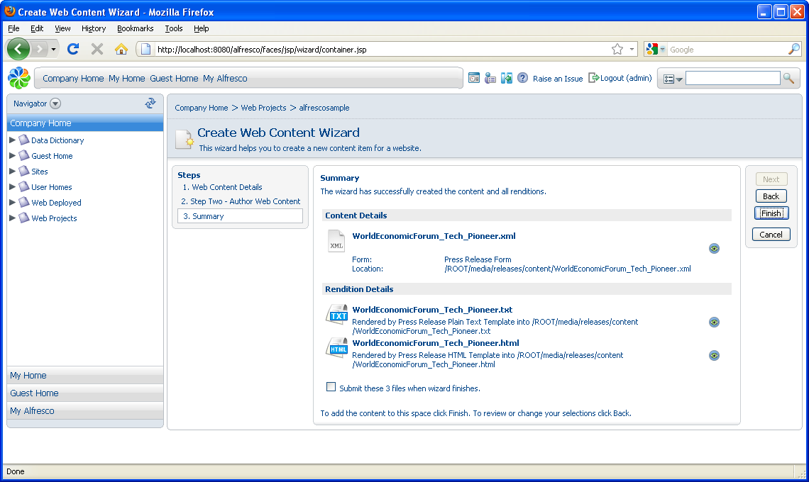
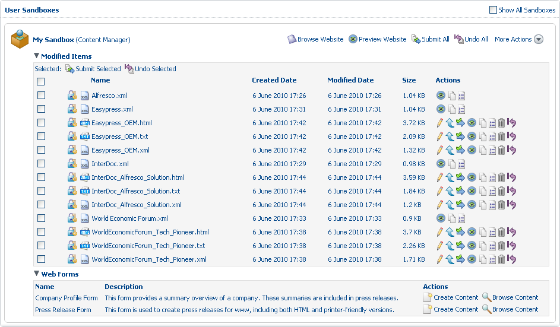

# Create web content: Press Releases

In this task, create additional content for your website using a web form with an associated template. Once the content is complete, you can preview it. Unlike in the previous task, do not submit the content; you will do this as a separate task.

1.  Return to the **Web Forms** list in your user sandbox and select the action **Create Content** associated with the **Press Release Form** web form.

    The Create Web Content Wizard opens.

2.  Complete each page of the wizard as follows, clicking **Next** to move to the next step.

    1.  Step One – Web Content Details

        Enter WorldEconomicForum\_Tech\_Pioneer as the **Name**.

    2.  Step Two – Author Web Content

        The fields and controls presented in this step are dictated by the selected web form. Use the following information to complete the page:

        -   **Title**

            World Economic Forum Announces Technology Pioneers 2007

        -   **Abstract**

            Alfresco selected by leading technology experts appointed by the World Economic Forum

        -   **Location**

            LONDON

        -   **Body \#1**

            The World Economic Forum today announced 47 Technology Pioneers for 2007. Alfresco Software has been selected as one of these Technology Pioneers. The Technology Pioneers were nominated by the world’s leading venture capital and technology companies.

        Click  beneath the **Body** text box to add an additional control for the second paragraph.

        -   **Body \#2**

            “We are proud to have won this award recognizing Alfresco’s technology, the global power of open source and the importance of managing content in economic development,” said John Newton. “We hope to use the opportunities created by this award to gain greater visibility to how information can help solve some of the world’s most pressing problems and how sharing and retaining knowledge can level the playing field for companies outside of the developed world.”

        -   **Include Company Footer \#1**

            World Economic Forum

        Click  beneath the **Include Company Footer** box to add a second footer option.

        -   **Include Company Footer \#2**

            Alfresco

        -   **Include Media Contacts**

            Yes

        -   **Category**

            Company

        -   **Launch Date**

            Select any date. This will not be used in the tutorial.

        -   **Expiration Date**

            Select any date. This will not be used in the tutorial.

    3.  Summary

        Review the summary screen, which should look like the following:

        

        Note that you are creating multiple items: the XML version as well as an HTML and a Plain Text rendition of the content. All versions will be stored in the location /ROOT/media/releases/content, which was specified when you created the Press Release Form web form. Unlike the company profile content, do not submit this press release to staging.

3.  Click the **Preview** icon next to the generated HTML page to see the virtualized view of the website with the pending changes. At the bottom of the generated HTML page, click **view plain text version** to check the link to the generated text file. Also, click the **News** link in the submenu to see that the JSP index page now has a link to the to-be-published content. If any changes need to be made, you can click the **Back** button in the wizard to modify and then regenerate the content.

4.  Click **Finish**. When you are returned to the sandbox view, expand the **Modified Items** list in your sandbox to see the three new content items generated from this web form.

    Note that because these content items have not been submitted, several additional actions are available for them.

5.  Repeat this process to create two more press releases using this web form. Again, do not submit the content.

    Press Release \#2

    -   **Name**

        Easypress\_OEM

    -   **Title**

        Alfresco and Easypress Technologies announce OEM Agreement for Atomik Dynamic Publisher, powered QuarkXPress Server 7

    -   **Abstract**

        Alfresco and Easypress Technologies announce ground-breaking Collaborative Publishing

    -   **Location**

        LONDON

    -   **Body \#1**

        Alfresco, the first and leading provider of an open source enterprise content management solution, today announced an OEM agreement to support the launch of Easypress Technologies’ new Atomik® Dynamic Publisher product, which works in conjunction with the new QuarkXPress® Server 7 from Quark.

    -   **Include Company Footer \#1**

        Easypress

    -   **Include Company Footer \#2**

        Alfresco

    -   **Include Media Contacts**

        Yes

    -   **Category**

        Company

    -   **Launch Date**

        Select any date. This will not be used in the tutorial.

    -   **Expiration Date**

        Select any date. This will not be used in the tutorial.

    Press Release \#3

    -   **Name**

        InterDoc\_Alfresco\_Solution

    -   **Title**

        InterDoc Chooses Alfresco to Deliver Solution for the Government of Quebec

    -   **Abstract**

        Alfresco continues Government Momentum in Canada

    -   **Location**

        LONDON

    -   **Body \#1**

        Alfresco Software Inc., the first provider of an open source enterprise content management solution, today announced that it has been chosen by InterDoc to create a new regulatory government solution for customers including the government of Quebec.

    -   **Include Company Footer \#1**

        InterDoc

    -   **Include Company Footer \#2**

        Alfresco

    -   **Include Media Contacts**

        Yes

    -   **Category**

        Company

    -   **Launch Date**

        Select any date. This will not be used in the tutorial.

    -   **Expiration Date**

        Select any date. This will not be used in the tutorial.

6.  In your user sandbox, expand the **Modified Items** list to view the nine new content items.

    

7.  Select **Preview Website** in your user sandbox. In the website preview, select **About Us** and then **News**. The JSP page displays a dynamic view of the website as it is staged in your sandbox. Test all three links to the newly created press release web pages. When done, close the preview.

    **Note:** If you do not see the new content, simply refresh your cache.

8.  Now select **Preview Website** in the Staging Sandbox. In the website preview, select **About Us** and then **News** to confirm that the new web pages are only available in the user sandbox. Close the preview.

**Parent topic:**[Add content to the web project](../concepts/gs-wcm-add-content.md)

