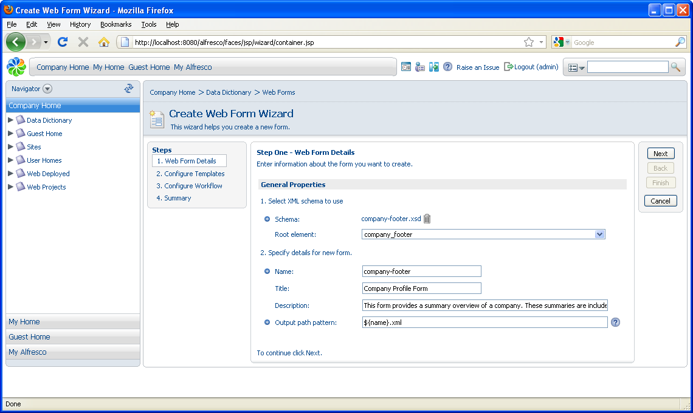
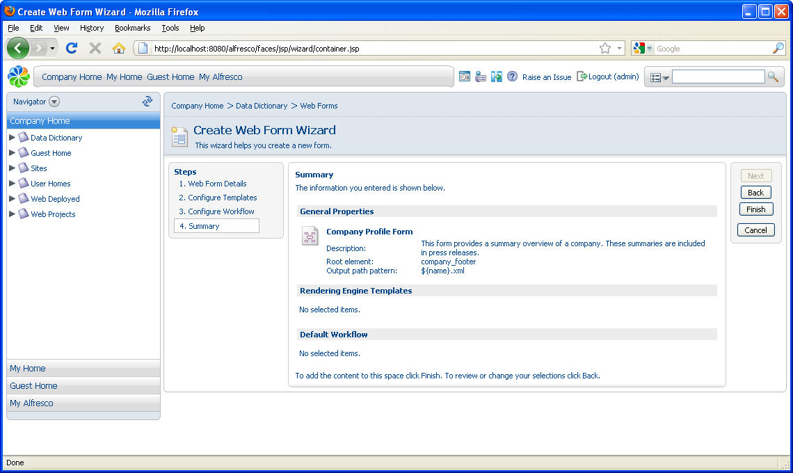
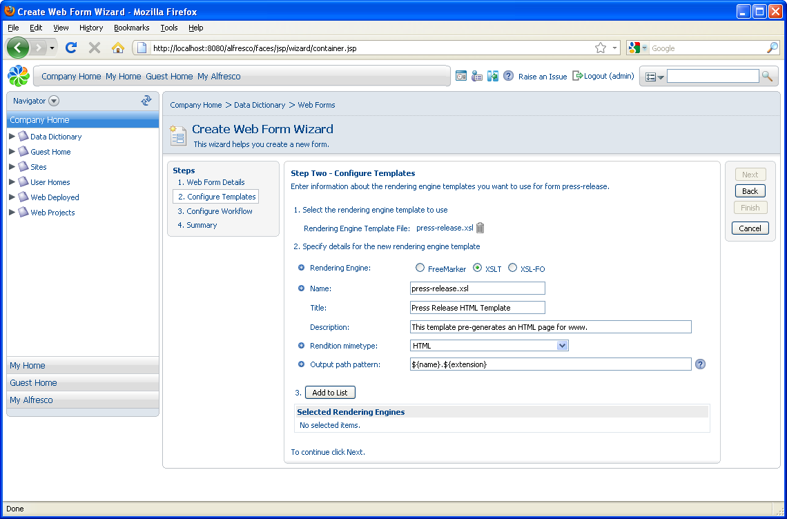
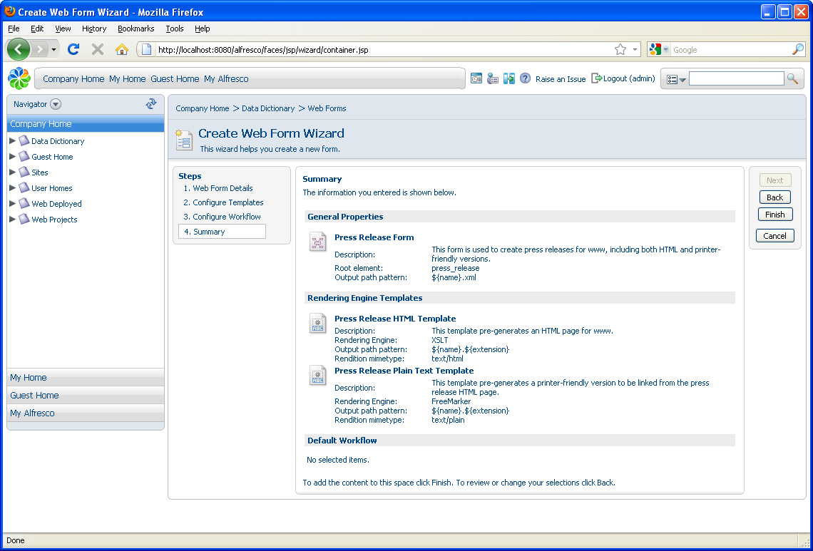

# Create web forms

A web form enables users to create XML content from a simple browser-based form. In this first task, you will create two web forms, one of which is associated with rendering engine templates.

Use the Create Web Form Wizard to work through the three steps involved in creating a web form:

-   Specify the general properties
-   Select and configure the desired rendering engine templates
-   Select a default workflow

In the next task, you will associate these web forms with your web project.

1.  In Explorer, navigate to **Company Home \> Data Dictionary \> Web Forms** and select **Create Web Form** in the **Create** menu.

    The Create Web Form Wizard opens.

2.  Complete each page of the wizard as follows, clicking **Next** to move to the next step.

    **Step One – Web Form Details**

    Use the **Browse** button to locate and upload the file **company-footer.xsd** from \\alfresco-enterprise-avm-3.4.14\\wcm-examples\\examples\\getting-started-sample in the location to which you extracted the tutorial sample files. This populates several boxes on this page.

    Complete Step One as follows:

    -   **Title**

        Company Profile Form

    -   **Description**

        This form provides a summary overview of a company. These summaries are included in press releases.

    -   **Output path**

        $\{name\}.xml

    

    **Step Two – Configure Templates**

    Leave all values blank.

    **Step Three – Configure Workflow**

    Select **No not now**. This step allows you to create a default workflow for content generated by this web form across all projects. You’ll configure workflow locally when you create your web project.

    **Summary**

    Review the summary screen, which should look like the following:

    

3.  Click **Finish**. The new web form, **company-footer**, appears as a space in the **Web Forms** space.

    You will now create the second web form.

4.  In the **Web Forms** space, select **Create Web Form** in the **Create** menu.

5.  Again, complete each screen as follows, clicking **Next** to move to the next step.

    **Step One – Web Form Details**

    Use the **Browse** button to locate and upload the file **press-release.xsd** from \\alfresco-enterprise-avm-3.4.14\\wcm-examples\\examples\\getting-started-sample in the location to which you extracted the tutorial sample files.

    Complete Step One as follows:

    -   **Title**

        Press Release Form

    -   **Description**

        This form is used to create press releases for www, including both HTML and printer-friendly versions.

    -   **Output path**

        $\{name\}.xml

    **Step Two – Configure Templates**

    Use the **Browse** button to locate and upload the file **press-release.xsl** from . Again, this populates several boxes on the page.

    Complete Step Two as follows:

    -   **Rendering Engine**

        XSLT

    -   **Title**

        Press Release HTML Template

    -   **Description**

        This template pre-generates an HTML page for www.

    -   **Rendition mimetype**

        HTML

    -   **Output path**

        $\{name\}.$\{extension\}

    

    Click **Add to List**.

    To associate a second template with the form, remain in Step Two and use the **Browse** button again and upload the file **press-release-plain-text.ftl** from the same location. Use the following information to complete the page:

    -   **Rendering Engine**

        FreeMarker

    -   **Title**

        Press Release Plain Text Template

    -   **Description**

        This template pre-generates a printer-friendly version to be linked from the press release HTML page.

    -   **Rendition mimetype**

        Plain Text

    -   **Output path**

        $\{name\}.$\{extension\}

    Click **Add to List**.

    **Step Three – Configure Workflow**

    Select **No not now**.

    **Summary**

    Review the summary screen, which should look like the following:

    

6.  Click **Finish**.

    The new web form, **press-release**, appears as a space in the **Web Forms** space.

**Parent topic:**[Set up the web project](../concepts/gs-wcm-setup-project.md)

