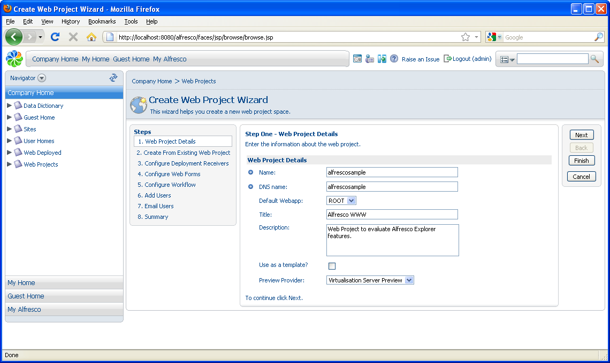
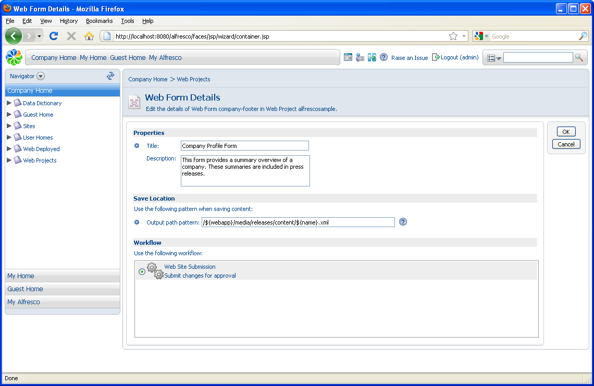
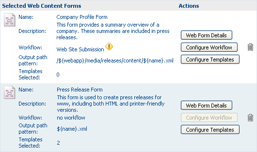
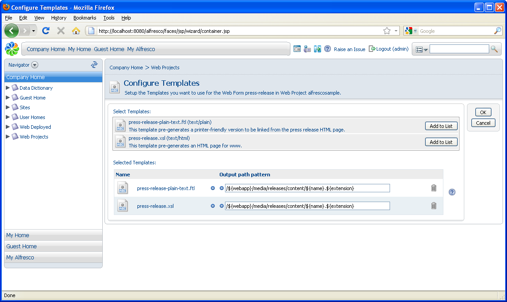
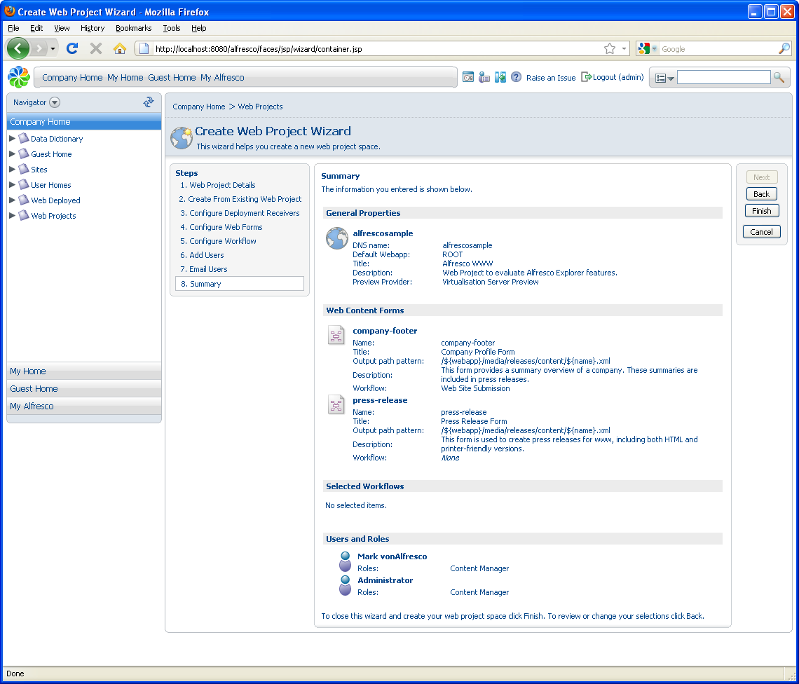

# Create the web project

You create a web project using the Create Web Project Wizard.

In this second task, you work through the wizard to complete the seven steps involved in creating a web project:

-   Specify the basic web project details
-   Indicate if you are creating a new project or using the structure of an existing project
-   Configure deployment servers
-   Select and configure web forms for generating site content
-   Select and configure workflow for content added that is not generated by a web form
-   Add users and assign user roles to them
-   Email a notification to the selected users

1.  Navigate to **Company Home \> Web Projects** and select **Create Web Project** in the **Create** menu to open the Create Web Project Wizard.

2.  Complete each page of the wizard as follows, clicking **Next** to move to the next step.

    **Step One – Web Project Details**

    Use the following information to complete the page:

    -   **Name**

        alfrescosample

    -   **DNS name**

        alfrescosample

    -   **Title**

        Alfresco WWW

    -   **Description**

        Web Project to evaluate Alfresco Explorer features.

    

    **Step Two – Create From Existing Web Project**

    Select **Create a new empty Web Project**.

    **Step Three – Configure Deployment Receivers**

    Click **Add Deployment Receiver** to display the configuration details.

    Use the following information to complete the page:

    -   **Type**

        Live Server

    -   **Host**

        localhost

    -   **Port**

        44100

    -   **Username**

        admin

    -   **Password**

        admin

    Click **Add**.

    **Step Four – Configure Web Forms**

    Click **Add to List** to the right of each web form to select them to be used with this project. The web forms appear in the **Selected Web Content Forms** section and you must edit the details for each.

    Configure the **Company Profile Form** as follows:

    -   Click **Web Form Details** for **Company Profile Form** and set the **Output path pattern** to /$\{webapp\}/media/releases/content/$\{name\}.xml.
    -   We want content generated by this template to be submitted to workflow, so select **Web Site Submission** in the **Workflow** section.

        

    -   Click **OK**. Notice the attention icon next to the workflow: .

        

        This indicates a workflow has been selected but not configured. Click **Configure Workflow** for this form. Search for and select the user Mark, then click **Add to List**. Click **OK**.

    Configure the **Press Release Form** as follows:

    -   Click **Web Form Details** for **Press Release Form** and set the **Output path pattern** to /$\{webapp\}/media/releases/content/$\{name\}.xml.
    -   For the **Press Release Form** web form, you must specify how each template associated with the form will generate web content. Click **Configure Templates** for this form and set the **Output path pattern** to /$\{webapp\}/media/releases/content/$\{name\}.$\{extension\} for both templates.

        

    -   Click **OK**.
    **Step Five – Configure Workflow**

    Selecting workflow in this step sets workflow for the web project as a whole. All content in the project not generated via a web form follows the workflow configured here. As you are only creating content using web forms in this tutorial, there is no need to select a workflow option in this step.

    **Step Six – Add Users**

    Using the search feature provided, locate and select the user Mark. Select **Content Manager** as the role for this user and click **Add to List**.

    **Step Seven – Email Users**

    Accept the default option **No** so that a notification email is not sent.

    **Summary**

    Review the summary screen, which should look like the following:

    

3.  Click **Finish**.

    The new web project, **alfrescosample**, appears in the **Web Projects** space.

    Completing the wizard automatically creates a source repository, called a Staging Sandbox, and a set of development repositories, called user sandboxes. There is one user sandbox for each user invited to work on the project, as well as an administrator sandbox.

**Parent topic:**[Set up the web project](../concepts/gs-wcm-setup-project.md)

