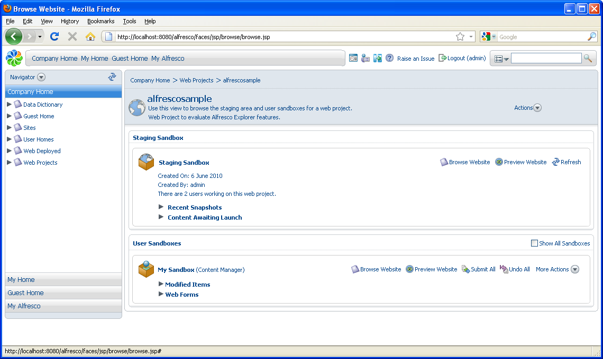
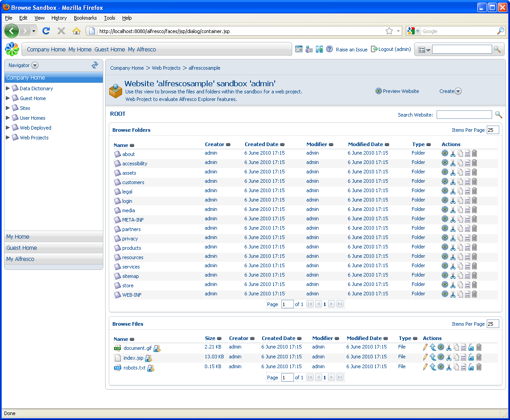

# Import the sample dynamic website

Your newly created web project, alfrescosample, contains no content. In this task, you will use the Bulk Import feature to populate the web project. Once imported, you will submit the content to staging to create an initial snapshot of the project, which you can preview.

1.  In the **Web Projects** space, click **alfrescosample**.

    

    The sandbox view appears displaying the staging and user sandboxes.

    Each user sandbox contains the existing web project content. The sandbox labelled **My Sandbox** belongs to the currently logged on user \(in this case, the administrator\).

    As the administrator, you have access to the sandboxes of all users associated with the web project. By default, only the Staging Sandbox and your user sandbox display; however, you can select the option **Show All Sandboxes** in this view to display all sandboxes available to you.

2.  In your user sandbox, click **Browse Website** to display the user sandbox, which is empty.

3.  Select **Bulk Import** in the **Create** menu.

4.  Use the **Browse** button to locate and upload the file **alfresco-sample-website.war** from \\alfresco-enterprise-avm-3.4.14\\wcm-examples\\examples\\getting-started-sample in the location to which you extracted the tutorial sample files. Once uploaded, click **OK** to begin the import.

    

    The .war file, which you imported into the current directory \(the ROOT web app\), appears in expanded form in your user sandbox.

    In WCM, a lock is automatically placed on content items created, imported, modified, or deleted in order to prevent editing clashes. In your sandbox, notice that all items \(not folders\) currently display a padlock icon with a key: . This indicates that you own the lock and can perform actions on the content. A lock owned by another user appears as a plain padlock: . You can position your cursor over the icon to display a tooltip indicating the lock owner.

5.  Click **Preview Website** in the sandbox header to see the website in its current state.

    The preview window displays how the website or web application will look with the user sandbox content submitted. Click **About us** and then **News** to display the empty **Alfresco Press Releases** page. We will come back to this again later once you have added some content.

6.  Close the preview and return to your user sandbox. Click **alfrescosample** in the breadcrumb path to return to the sandbox view.

7.  In your user sandbox, expand the **Modified Items** list to display the imported content.

8.  Click **Submit All** and, on the **Submit Items** page, provide the information that will display as the name and description of the corresponding snapshot in staging:

    1.  **Label**: Initial Import

    2.  **Description**: Sample website

9.  Click **OK**.

    The submission takes place in the background and each content item remains in the **Modified Items** list until its submission is complete.

10. Refresh the page as necessary until the **Modified Items** list is empty. In the Staging Sandbox, expand the **Recent Snapshots** list to view the snapshot you have created.

**Parent topic:**[Add content to the web project](../concepts/gs-wcm-add-content.md)

