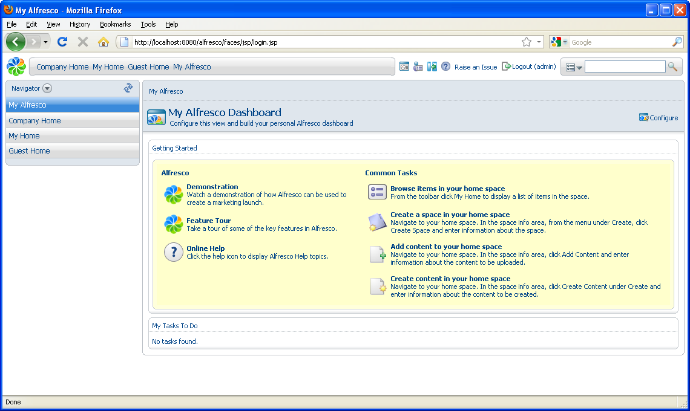

# Log in

Log in to Alfresco Explorer using the default credentials.

1.  Type the following on the login page:

    1.  **Username**: admin

    2.  **Password**: admin

2.  Click **Login**.

    

    On entering the application, your dashboard displays.

**Parent topic:**[Using the AVM to Manage Web Content](../concepts/gs-wcm-intro.md)

