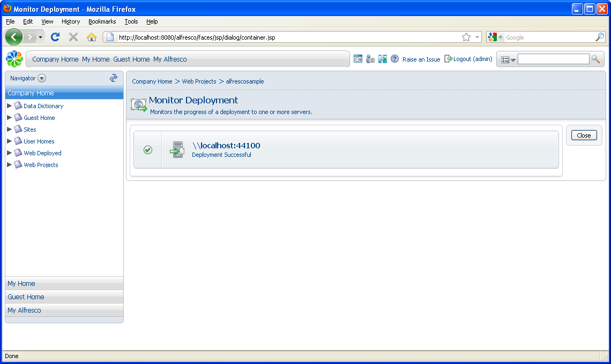
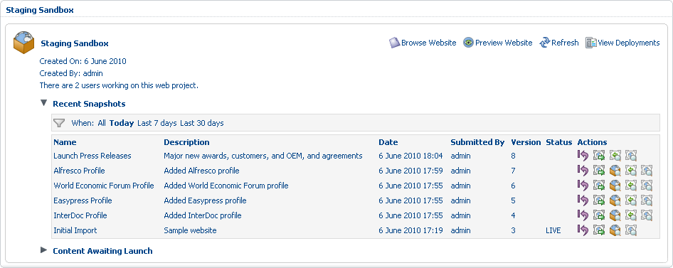

# Publish the website

With the web project content complete and submitted, you can now publish the Staging Sandbox snapshot to the production environment. We’ll deploy the website in stages, beginning with the initial version of the site after the content was imported to the project.

Once published, you still have the option to revert to a previous version of the project, which you will examine in the next task.

1.  In the Staging Sandbox, locate the **Initial Import** snapshot \(version 3\) and select the **Deploy** icon: .

2.  On the **Deploy Snapshot** page, confirm the selection of the remote target server, localhost, and click **OK**.

    

3.  Close the **Monitor Deployment** page once the snapshot is successfully deployed. In the **Recent Snapshots** list, note that version 3 is listed as being LIVE.

    

4.  Click **View Deployments** to review the deployment report. Click **Close** to return to the Staging Sandbox where you can deploy another version of the website.

5.  Expand the **Recent Snapshots** list again and deploy the most recent snapshot, **Launch Press Releases** \(version 8\). Again, confirm the target server and click **OK**.

6.  In the **Recent Snapshots** list, confirm that version 8 is currently the live version of the site.

-   **[Roll back to a previous snapshot](../tasks/gs-wcm-rollback.md)**  
You can roll back a site to ensure an older version of the content is being delivered in the live environment and also to allow re-edits prior to deployment. An example of where this is useful is the rollout of a new section of the site or the addition of application functionality. In these cases, simply redeploying an older site version is not enough: you also need to roll back the current working copy of the site for your Contributors, Publishers, Developers, and Designers to correct errors, restage, and redeploy the content.

**Parent topic:**[Using the AVM to Manage Web Content](../concepts/gs-wcm-intro.md)

