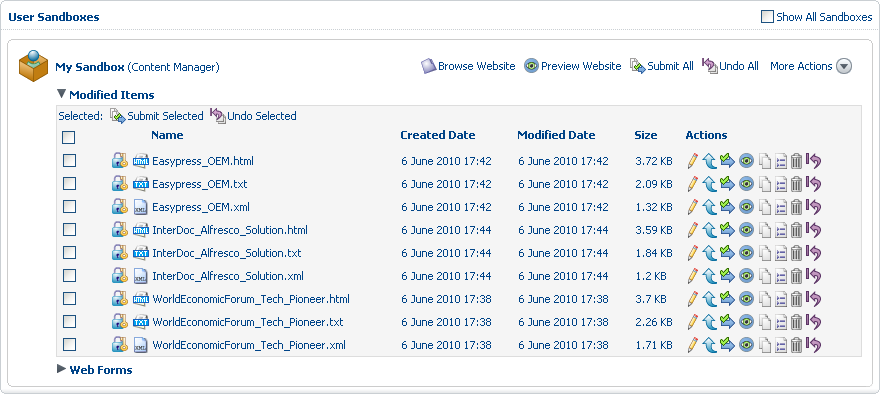
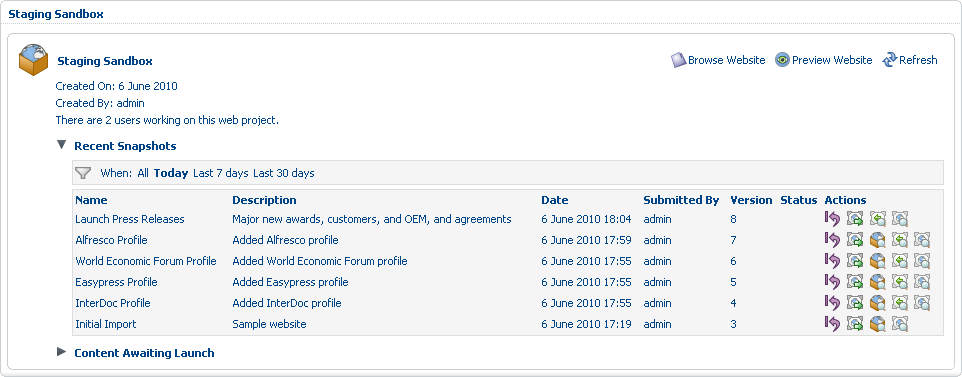

# Submit content

With the website content now complete, we need to confirm how these changes will look within the website. To do this, you promote the content items from your user sandbox to the Staging Sandbox.

Though you will submit all items at once, you do have the option to submit a single item or a group of selected items.

1.  In your user sandbox, expand the **Modified Items** list to display the content items you created.

    With the company profiles already submitted, your user sandbox now contains only the nine press releases.

    

2.  Click **Submit All** and, on the **Submit Items** page, provide the information that will display as the name and description of the corresponding snapshot in staging:

    1.  **Label**: Launch Press Releases

    2.  **Description**: Major new awards, customers, and OEM, and agreements

3.  Click **OK**.

    Again, the submission is processed in the background. Each content items remain in the **Modified Items** list until its submission is complete.

4.  After a few moments, refresh the page to see the empty **Modified Items** list in your user sandbox. Expand the **Recent Snapshots** list in the Staging Sandbox to see the submitted content: **Launch Press Releases**.

    

    Now that the press releases have been committed to staging, you can deploy, or publish, the snapshot to ensure your audience can see the content.

**Parent topic:**[Manage web project content](../concepts/gs-wcm-manage-content.md)

