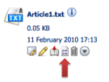
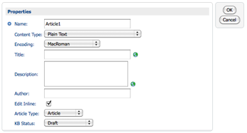

# Editing a Knowledge Base article

Modify the properties of a Knowledge Base article in Alfresco Explorer.

1.  In your Knowledge Base space in Alfresco Explorer, locate the content item you want to edit, for example, **Article1.txt**, and click its View Details icon.

    The Details page lists all the properties of the content item. If you previously used `kb:articletype` and `kb:status properties`, they will appear exactly as you instructed.

    

2.  Click Modify on the top right of the Properties pane to open the Modify Content Properties window for editing these values.

    

3.  Make any changes you want.

4.  Click OK to commit the changes and save your content item.

**Parent topic:**[Getting started](../concepts/kb-about.md)

