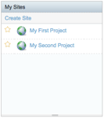

# Adding and editing content

Once your Knowledge Base is inside the document library, you can add content to the library and edit the content metadata using Alfresco Share.

1.  Open a browser to Alfresco Share. You can access Alfresco Share using the URL http://localhost:8080/share

2.  Log in to Alfresco Share. You can use the following credentials to log in as administrator.

    -   User name: admin
    -   Password: admin
    The user dashboard displays. It displays a dashlet that lists all the sites you created while building this sample application.

    

3.  Click **My Second Project** in this dashlet to go into the Alfresco Share site.

4.  In the Site menu, click **Document Library** to navigate to the document library.

5.  Click **Show Folders**.

    All folders in the document library display, including your Knowledge Base space.

6.  Click the **Knowledge Base** space to navigate into it.

    The Knowledge Base space contains an Archived folder because you used your Knowledge Base space template to stamp out the structure and rules. The Knowledge Base space is pre-configured.

7.  Click **Upload** under the navigation menu.

    The Upload window displays letting you upload one or multiple files.

8.  In the Upload window, select the files to upload, click **Upload Files** to send your files to the document library, and then click **OK** to close the Upload Files dialog box.

    Your content appears in the document library along with a thumbnail icon identifying the document content.

9.  Click the document to bring up the document details and preview.

    The left-hand side displays a Flash preview of the document you uploaded. The rest of the page shows details about the document.

    The document was automatically marked with the `kb:article` aspect because you uploaded it into the Knowledge Base. You defined a rule for the Knowledge Base \(the first of three\) that automatically marked any content placed into it with the `kb:article` aspect. Notice that content was tagged with the Alfresco Tag Service. It has tags that show up in the metadata viewer because a server-side JavaScript file was previously uploaded to trigger the rule and kick off this script.

10. To edit the document's metadata, click **Edit Metadata** in Document Actions on the right of the window.

    The metadata editor appears. It uses the Forms configuration you provided for Alfresco Share. The form displayed uses the template and settings you provided for the edit-form portion of your configuration block.

11. Make any changes to the document metadata and click **Save**.

    The Forms engine maps your values back onto the object and saves it. Notice the form does not display the `kb:status` field because you indicated in your form configuration that you did not want this field to display for the edit-form. This prevents editors from changing the article’s lifecycle without it first passing through a formal approval process.

**Parent topic:**[Customizing Alfresco Share \(advanced\)](../concepts/kb-share-customize-adv.md)

