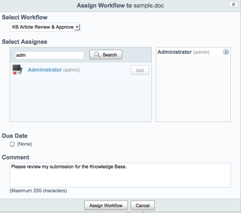
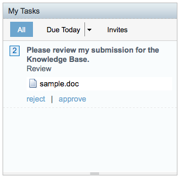

# Approving content

Adding a Knowledge Base article automatically assigns it a “Draft” lifecycle state as per the rules on your Knowledge Base space. To approve this article, it must participate in a workflow process and be formally approved. The workflow process you bootstrapped into the repository will do this; all you need to do is assign the Knowledge Base article to the workflow and let the workflow engine take over. It will pass the article to someone for approval; if approved, the article's lifecycle state will change to “Current” and its `kb:status` field will update. This update triggers the rules on your Knowledge Base space to automatically invoke the Tags Service.

This example submits the Knowledge Base article for approval by assigning it a workflow and then approving the article.

1.  In your Knowledge Base space in Alfresco Share, click **Assign Workflow**.

    Your custom workflow is available as one of the options you can select under Select Workflow titled “KB Article Review & Approve”. This is the workflow process definition you bootstrapped into your Alfresco repository and then configured to appear as an available option for Alfresco Share.

    

2.  Select the **KB Article Review & Approve** workflow.

    You must assign someone to act as the approver of the workflow. Assign yourself \(Administrator\) for the purposes of this example. The Administrator user was assigned as the recipient of the workflow.

    The KB Article Review & Approve workflow is a simple example that allows you to pick who you want to approve the Knowledge Base article. In practice, you would constrain this set to one or more in a group of knowledge experts.

3.  Fill in a comment for the workflow.

    If a comment is not provided, the workflow cannot be assigned.

4.  Click **Assign Workflow**.

    The workflow is assigned to the document, putting into motion the request for your approval for your Knowledge Base article.

5.  At the top of the page, click **My Dashboard** to return to your user dashboard.

    A dashlet on your user dashboard below the Sites dashlet called “My Tasks” shows all tasks in your to-do list, including in-flight workflows.

    

6.  In My Tasks, click **approve**.

    The dashlet refreshes, indicating that your workflow successfully approved the Knowledge Base article.

7.  Click **Task Done** to complete the task.

8.  In the My Sites Dashlet, click **My Second Project** to verify that the Knowledge Base article successfully transitioned out of “Pending Approval” and into the “Current” lifecycle state.

The Knowledge Base dashlet you built now reflects that your site’s Knowledge Base has one article in the “Approved” state.

**Parent topic:**[Customizing Alfresco Share \(advanced\)](../concepts/kb-share-customize-adv.md)

