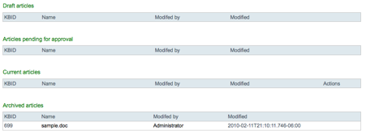

# Archiving content in the Knowledge Base

You configured Alfresco Share to provide an Archive action for documents. You can now trigger this action and archive your document.Archiving lets you complete the content lifecycle for documents. Documents that are current must eventually be replaced as new information or better content becomes available. You should archive your current documents prior to replacing them so that they are backed up. When you are sure that you will not require these documents any more, you may choose to delete them.

1.  In the Alfresco Share navigation menu, click **Document Library** to go to the document library for the site.

2.  Click the **Knowledge Base** folder to go into the Knowledge Base space.

    **Note:** If the Knowledge Base folder does not appear, click **Show Folders**.

    From the document list, a list of action commands displays with three choices: “Download”, “Edit Metadata”, and “Upload New Version”.

3.  Click **More…** to see a list of additional available actions.

    The Archive action appears at the bottom.

4.  Click the **Archive** action to archive the document.

    This invokes your browser-side JavaScript function, which makes a proxy request back to the Alfresco Share server. Alfresco Share then invokes the appropriate HTTP POST handler on the document library services in the Alfresco repository.

    You added the custom HTTP POST handler as part of your customization to the document library services. This handler will set the `kb:status` property of your document to the value “Archived”. It will also save the document.

    Once the document is saved, the second of your three rules on the document library space triggers because the Update event of the document was raised as the document was saved. The rule executes and the document is moved to the Archived folder.

5.  In the navigation menu, click the **Knowledge Base** page to see your article in the Custom Site page you previously built.

The sample Knowledge Base application is completed.

**Parent topic:**[Customizing Alfresco Share \(advanced\)](../concepts/kb-share-customize-adv.md)

