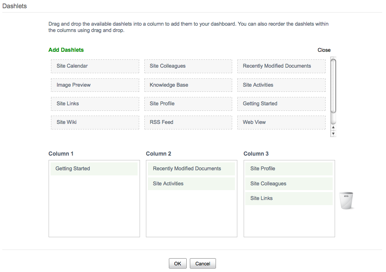

# Adding a custom dashlet to your site

Adding the dashlet to the site dashboard makes the custom Knowledge Base dashlet available for users to instantly see what is happening in the Knowledge Base when they arrive to the site.

1.  At the top of the site page, click Customize Dashboard.

    A window displays showing a list of the dashlets that are configured for the site dashboard.

    

2.  Click Add Dashlets to see a list of available dashlets, including your custom Knowledge Base dashlet.

    

3.  Click the Knowledge Base dashlet, and then drag and drop it into one of the three columns on the bottom part of the window.

4.  Click OK to save your changes.

    The site dashboard displays with your Knowledge Base dashlet in the page location that you specified.

Your Knowledge Base does not yet have any content because the articles you may have previously created were in a space under Company Home. The dashlet is looking for Knowledge Base articles that are specifically located in this Alfresco Share site that may not have yet been created.

**Parent topic:**[Customizing Alfresco Share \(basic\)](../concepts/kb-share-customize-about.md)

