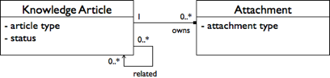

# Defining a custom model for Knowledge Base articles

This custom model example uses an uncomplicated model for representing knowledge base articles for a Knowledge Base application.

The Knowledge Base model uses most of the constructs of the content metamodel. The primary entity in the model is the knowledge article, which encapsulates knowledge as an answer or a white paper. Articles may relate to each other, and supplementary artifacts, such as software patches and sample code, may be attached to the article.



This also defines a type for the attachment, which inherits from the `cm:content` type defined in the ECM domain model. An additional property represents the attachment type whose value is constrained to one of Patch, Sample, and Documentation.

An aspect is defined for the article with the intent that any existing content held in the content repository may become an article. The aspect defines an article type property whose value is constrained to Article, FAQ, and White Paper. It also includes a status property through a status aspect whose value is constrained to Draft, Pending Approval, Current, or Archived. A child association represents the relationship between article and attachment. Attachments are owned by articles and therefore do not outlive their owning article, which child association semantics support. Related articles are peers.

1.  Start defining a Knowledge Base model by setting up the model header to introduce the model.

    ```
    <model name="kb:contentmodel" xmlns="http://www.alfresco.org/model/dictionary/1.0">
       <description>Knowledge Base Content Model</description>
       <author>alfresco_professional</author>
       <version>1.0</version>
    ```

    A namespace scopes the model names. In this case, the model name `kb:knowledgebase` uses the namespace prefix `kb`.

2.  Define the model's associated namespace.

    ```
    <imports>
      <import uri="http://www.alfresco.org/model/dictionary/1.0" prefix="d"/>
      <import uri="http://www.alfresco.org/model/content/1.0" prefix="cm"/>
    </imports>
    
    <namespaces>
      <namespace uri="http://www.alfresco.org/model/knowledgebase/1.0" prefix="kb"/>
    </namespaces>
    ```

    As well as defining a new namespace, two out-of-the-box content models \(the Data Dictionary and ECM domain model\) are imported.

3.  Define standalone constraints to restrict the values of attachment type, status, and article type, which are ideally constrained through the `LIST` constraint.

    ```
    <constraints>
      <constraint name="kb:attachmenttype_constraint" type="LIST">
        <parameter name="allowedValues">
          <list>
            <value>Patch</value>
            <value>Sample</value>
            <value>Documentation</value>
          </list>
         </parameter>
        </constraint>
     <constraint name="kb:status_constraint" type="LIST">
       <parameter name="allowedValues">
         <list>
           <value>Draft</value>
           <value>Pending Approval</value>
           <value>Current</value>
           <value>Archived</value>
         </list>
        </parameter>
      </constraint>
     <constraint name="kb:articletype_constraint" type="LIST">
        <parameter name="allowedValues">
          <list>
           <value>Any</value>
           <value>Article</value>
           <value>FAQ</value>
           <value>White Paper</value>
          </list>
         </parameter>
      </constraint>
    </constraints>
    ```

4.  Define the attachment type with a single property, whose data type is `d:text` and whose value is constrained through the standalone constraint `kb:attachmenttypelist` defined earlier in the model. For completeness, specify a default value.

    ```
    <types>
      <type name="kb:attachment">
        <title>Attachment</title>
        <parent>cm:content</parent>
        <properties>
          <property name="kb:attachmenttype">
          <title>Attachment Type</title>
          <type>d:text</type>
          <default>Sample</default>
          <constraints>
            <constraint ref="kb:attachmenttype_constraint" />
          </constraints>
          </property>
        </properties>
      </type>
    </types>
    ```

    Through namespace prefixes, references to imported definitions are simply made, such as to the `d:text` data type and `cm:content` type.

5.  Define the article aspect similarly as the attachment type, only this time specify an inline constraint for its property.

    ```
    <aspects>
      <aspect name="kb:article">
        <title>Knowledge Base Article</title>
        <properties>
          <property name="kb:articletype">
          <title>Article Type</title>
          <type>d:text</type>
          <default>Article</default>
          <constraints>
            <constraint type="LIST">
              <parameter name="allowedValues">
              <list>
                <value>Any</value>
                <value>Article</value>
                <value>FAQ</value>
                <value>White Paper</value>
              </list>
              </parameter>
            </constraint>
           </constraints>
          </property>
    </properties>
    ...
    ```

6.  Set the article aspect to represent the source and provide the association definitions. Associations are between a source and target class.

    ```
    ...
    <associations>
      <child-association name="kb:artifacts">
        <target>
         <class>kb:attachment</class>
         <mandatory>false</mandatory>
         <many>true</many>
    </target>
    
        <duplicate>true</duplicate>
      </child-association>
      <association name="kb:related">
        <title>Related Articles</title>
        <source>
           <mandatory>false</mandatory>
           <many>true</many>
        </source>
        <target>
           <class>kb:article</class>
           <mandatory>false</mandatory>
           <many>true</many>
        </target>
       </association>
      </associations>
     </aspect>
    </aspects>
    ```

7.  Close the model.

    ```
    </model>
    ```

8.  Save the XML to a file on the Java classpath for registration by a Dictionary Bootstrap component at repository startup time, or as a file in the content repository folder Company Home/Data Dictionary/Models for dynamic registration.


**Parent topic:**[Content modeling](../concepts/content-modeling-about.md)

