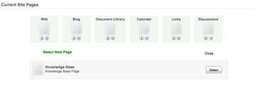
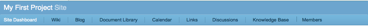
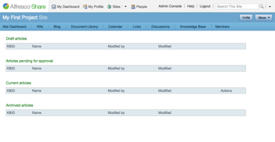

# Adding a custom page to a Share site

Site managers can configure additional pages for sites and remove unwanted pages.

This task adds an existing custom page to your site.

1.  At the top of the site page, click the More menu, and then click Customize Site.

    A listing of all of the pages that currently comprise your site displays.

2.  Click Add Pages.

    This brings up a selection of site pages that are available and not currently being used by your site. Your Knowledge Base Page should be listed among the available options.

    

3.  Click Select for the Knowledge Base page.

4.  Click OK to save your changes.

    The site dashboard displays showing where the Knowledge Base page appears in the navigation menu.

5.  In the navigation menu, click Knowledge Base to render your custom Knowledge Base page.

    

    

You created a new site page and added it to your site. It reuses much of the Alfresco Share user interface and looks consistent with the rest of the application. Your custom web script is in the middle of the page.

**Parent topic:**[Customizing Alfresco Share \(basic\)](../concepts/kb-share-customize-about.md)

