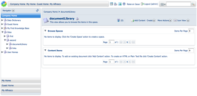

# Setting up a Knowledge Base

A custom Knowledge Base site preset was created for Alfresco Share and used to build a new site. This site was called “My Second Project” and given the short name “second”. This example describes how to add a Knowledge Base space to this site’s document library in Alfresco Explorer.

1.  Open a browser to Alfresco Explorer. You can access Alfresco Share using the following URL:

    http://localhost:8080/alfresco

2.  Log in to Alfresco Explorer. You can use the following credentials to log in as administrator.

    -   User name: admin
    -   Password: admin
3.  Click **Company Home** to go to the root space of the repository.

4.  In the navigator view on the left side of the window, click the arrow next to Sites.

5.  In the Sites subspaces, expand **second** and click **documentLibrary** to go to the document library for the “My Second Project” site.

    

    **Note:** If “documentLibrary” does not exist, go to your Knowledge Base site in Alfresco Share and click the Document Library tab in the navigation menu.

6.  Click the **Create** menu and select **Advanced Space Wizard** from the list.

7.  In the Advanced Space Wizard:

    1.  In Step One - Starting Space, select **Using a template** and click **Next**.

    2.  In Step Two - Space Options, select **Knowledge Base Project** from the list and click **Next**.

    3.  Name your new Knowledge Base Knowledge Base. You can leave the description field blank.

    4.  Click **Create Space** to create the space.

The document library now has a Knowledge Base space under it set up with rules you previously set.

**Parent topic:**[Customizing Alfresco Share \(advanced\)](../concepts/kb-share-customize-adv.md)

