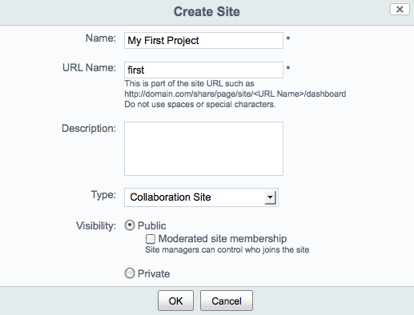

# Creating a new Alfresco Share site

This describes how to create a simple collaboration site in Alfresco Share and configure it to use your new site page.

1.  In a browser, enter the following URL:

    http://localhost:8080/share

2.  Log in to Alfresco Share.

    If prompted, log in with the administrator account \(user name `admin`, password `admin`\).

3.  On the user dashboard, open the Sites menu and click Create Site.

4.  In the Create Site window:

    1.  In the Name field, provide a name for your site, such as My First Project.

    2.  In the URL Name field, type first.

    3.  In the Description field, enter a description or leave the field blank.

    4.  In the Type list, select Collaboration Site.

5.  Click OK to create the site.

    

Since you were the one to create the site, you are automatically designated as the site manager. You can set up the site dashboard, invite new participants to the site, and specify their roles and rights.

**Parent topic:**[Customizing Alfresco Share \(basic\)](../concepts/kb-share-customize-about.md)

