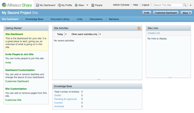

# Creating a Knowledge Base site

Try out your new site preset by creating a new Knowledge Base Share site.

1.  On your Alfresco Share dashboard, open the Sites menu and click Create Site.

2.  In the Create Site window:

    1.  In the Name field, type My Second Project.

    2.  In the URL Name field, type second.

    3.  In the Description field, enter a description or leave the field blank.

    4.  In the Type list, select Knowledge Base Site.

    

3.  Click OK to create the site.

    The site dashboard displays. There should be four dashlets on the site dashboard and a limited number of pages.

    **Note:** When you defined the additional preset in presets.xml, you constrained the number of dashlets to four \(Getting Started, Site Activities, Knowledge Base, and Site Links dashlets\). You also limited the number of pages to four \(Knowledge Base, Document Library, Links, and Discussions pages\). The Site Dashboard and Members pages are mandatory.

    

4.  Click the Document Library tab in the menu bar.

    This ensures the document library services initialize for your site. It helps to ensure your site space contains a sub-folder named `documentLibrary`, which you can use for advanced Share customizations.

**Parent topic:**[Customizing Alfresco Share \(basic\)](../concepts/kb-share-customize-about.md)

