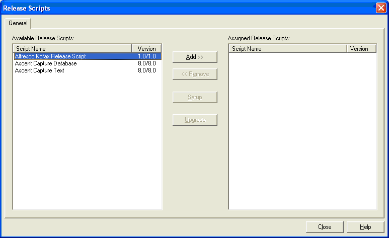
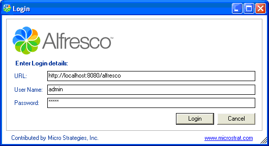

# Associating the Alfresco Kofax Release script with a document class

Once you have set up a batch class with an associated document class in Kofax Capture, you can associate a Release script with the batches document class. As part of this process, you are prompted to enter the connection details for your Alfresco server.

1.  Start the Kofax Capture Administration Module.

2.  Select the **Batch class** tab from the Definitions panel, and right-click the applicable document class. \(Expand the Batch class item to select associated document classes.\)

3.  From the **Context** menu, select **Release Scripts**.

    

    The **Release Scripts** dialog box displays, listing all available release scripts. Available release scripts are those that are registered with Kofax Capture.

4.  From the Release Scripts dialog box, select the Alfresco Kofax Release Script, and click **Add**.

    

    The Login dialog box displays.

5.  Enter your Alfresco server URL, user name, and password.

6.  Click **Login**.

**Parent topic:**[Configuring the Alfresco Kofax Release script](../concepts/kofax-config.md)

