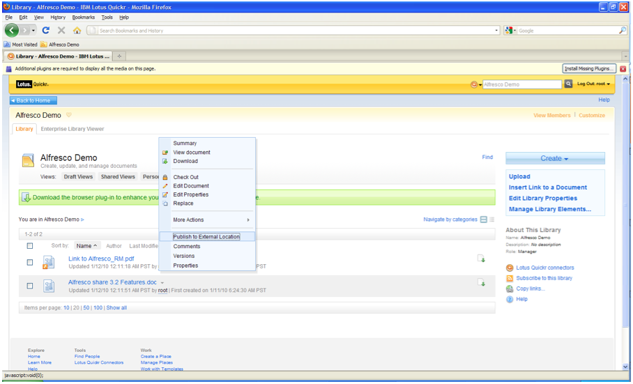
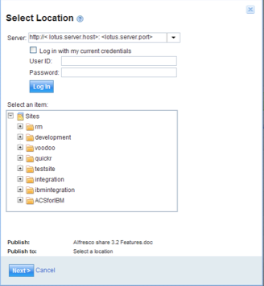
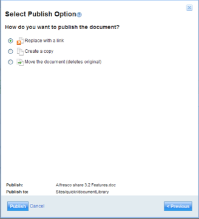

# Publishing content from Quickr to Alfresco

You can publish documents to Alfresco from the Lotus Quickr Library.

1.  In Lotus Quickr, right-click on a document, and then select **Publish to External Location**.

    

    You see the location of Alfresco sites.

2.  During the publish process, enter the server details and the Alfresco Share login credentials.

    For example, the server details are `http://< lotus.server.host>: <lotus.server.port>` as configured.

    

3.  Alfresco supports all the three publishing options that Quickr provides:

    -   **Replace with a Link**: the document is removed from Quickr library and added to Alfresco. A link pointing to the document in Alfresco is added to the Quickr Library. Click the link in Quickr to open the document in Alfresco.
    -   **Create a Copy**: the document remains in Quickr library, and a copy is added to Alfresco.
    -   **Move the Document**: the document is deleted from the Quickr library and is added to Alfresco.
    

**Parent topic:**[Installing and configuring IBM Lotus Quickr integration](../concepts/quickr-intro.md)

