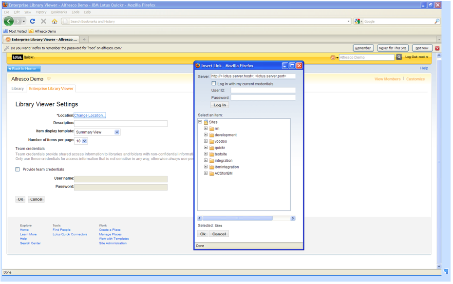

# Configuring Quickr to browse Alfresco as the Enterprise library

In Quickr, you can use the Enterprise Library Viewer to browse Alfresco as an enterprise library.

1.  In Quickr, select the **Enterprise Library Viewer** tab.

2.  Browse to Alfresco as an enterprise library.

    

3.  To configure the settings, select the **Enterprise Library Viewer** tab, and then select Alfresco as the server location.

4.  Browse the sites in Quickr and select content from Alfresco in Quickr.

    The content opens in Alfresco.

**Parent topic:**[Installing and configuring IBM Lotus Quickr integration](../concepts/quickr-intro.md)

