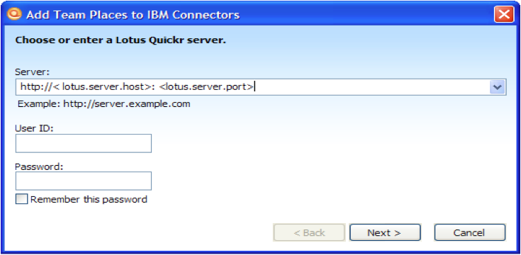
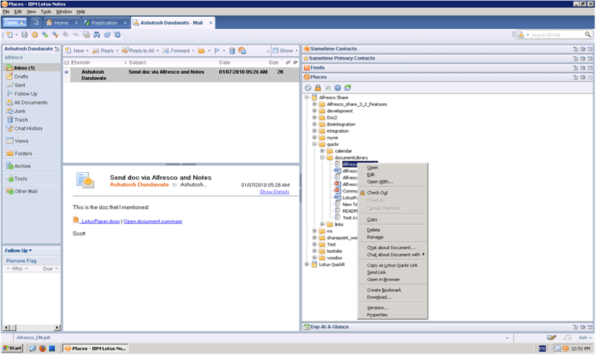

# Accessing Alfresco as a Team Place using Quickr connectors

You can also add Alfresco as a Team Place to provide access to Alfresco from the standard Quickr connectors.

This enables you to perform Alfresco content management operations using the following:

-   Lotus Notes: Lotus Notes IBM Lotus Notes 8.5
-   Microsoft Office 2003 or Microsoft Office 2007
-   Microsoft Windows Explorer for Windows XP

1.  Access the Connector for which you want to add Alfresco as a Team Place.

2.  Add a Team Place, specifying the Alfresco URL \(as configured during installation\) as the server.

    

3.  From the Team Place, you can perform operations such as check in, check out, versioning, and sending documents as a link using email.

    The following example shows Alfresco Share as Team place in a Lotus Notes client.

    

**Parent topic:**[Installing and configuring IBM Lotus Quickr integration](../concepts/quickr-intro.md)

