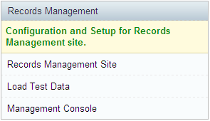
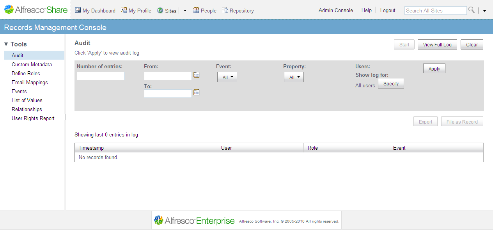

# Accessing the Records Management Console

This task assumes that you have access to the Records Management site dashlet and that you are logged in as a user who is a member of the **ALFRESCO\_ADMINISTRATORS** group.

1.  Click **My Dashboard**.

2.  In the Records Management dashlet, click **Management Console**.

    

    The Management Console displays, with the Audit tool showing, by default.

**Attention:** If you see the following message in the Management Console, Access Denied - additional permissions are required to access this component, you must add your user account to the **Records Management Records Manager** group.

**Parent topic:**[Managing the Records Management system](../concepts/rm-gs-manconsole.md)

