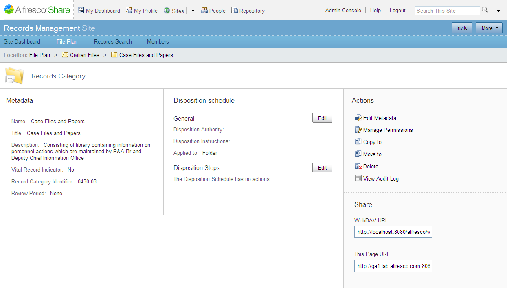
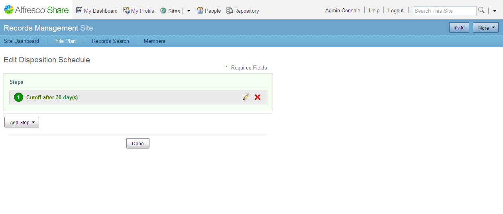
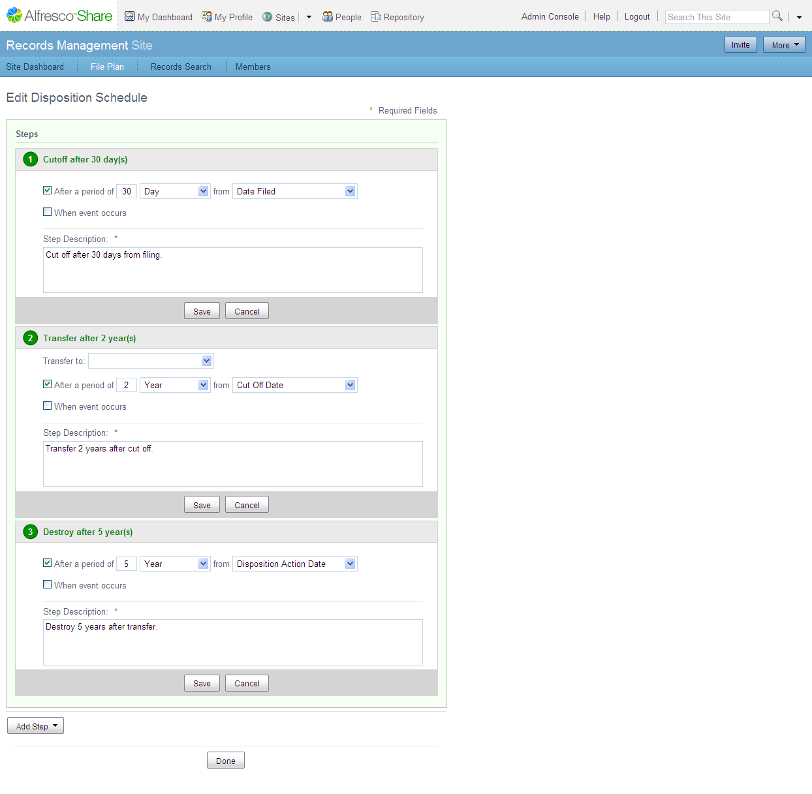

# Creating a disposition schedule

The disposition schedule must be defined at a record category level. The procedure for creating a disposition schedule is a two part process: the first part is to create a summary of the schedule; the second part is to create the steps in the schedule.

These step help you set a disposition schedule for the following example:

*Cutoff 30 days after filing, transfer to offline storage two years after cutoff and destroy seven years after transfer.*

1.  In the File Plan, navigate to a category.

    The disposition instructions display on the category summary. When there are no instructions set, the **Disposition Authority** and **Disposition Instructions** fields are empty.

2.  Position the cursor over the category, and then click **View Details** from the actions list.

    The record category details page displays. The disposition schedule summary shows the **General** information and the **Disposition Steps**.

    

3.  In the **General** section, click **Edit**.

4.  Type the summary information for the disposition schedule.

    1.  **Disposition Authority**: Type a description of the legislation that states how the record should be retained and disposed.

    2.  **Disposition Instructions**: Type a plain text version of the disposition schedule. Although this information is not used by the system, it is important from a legal perspective.

        For example, type Cutoff 30 days after filing, transfer to offline storage 2 years after cutoff and destroy 7 years after transfer.

    3.  **Applied to**: Select **Folder** to run the disposition schedule on the folder.

        The folder is cut off or transferred as a unit and the operation applies to all the records within the folder. With this setting, you cannot manage records as individual units. If you cut off the folder, all records will be cut off. If you select **Record**, the disposition schedule is set to work on the records and all operations occur at the record level. The default is **Folder**.

    4.  Click **Save**.

5.  In the **Disposition Steps** section, click **Edit**.

    The Edit Disposition Schedule page displays, showing the disposition steps.

6.  Click **Add Step** to add a disposition step.

    A menu displays with available actions. When you add the first step, only the **Retain** and **Cutoff** actions are available.

7.  Select **Cutoff**.

8.  Enter the details of the step in the following fields:

    An asterisk next to the name indicates that the filed is mandatory and you must enter text or a value in the field.

    1.  In the **After a period of** field, select the check box and type 30.

    2.  Select **Day** from the menu.

    3.  Select **Date Filed** from the menu.

    4.  In the **Step Description** field, you must type a description of the step.

    5.  Click **Save** to save the step.

    The first steps displays in the Edit Disposition Schedule page.

    

9.  Click **Add Step** to add the next disposition step.

10. Select **Transfer**.

11. Enter the details of the step in the following fields:

    1.  In the **Transfer to** field, select the location.

        **Note:** The values in this list are created in the List of Values tool in the Management Console. This task is covered in [Creating list of values](../concepts/rm-gs-lov.md).

    2.  In the **After a period of** field, select the check box and type 2.

    3.  Select **Year** from the menu.

    4.  Select **Cut Off Date** from the menu.

    5.  In the **Step Description** field, you must type a description of the step.

    6.  Click **Save** to save the step.

12. Click **Add Step** to add the next disposition step.

13. Select **Destroy**.

14. Enter the details of the step in the following fields:

    1.  In the **After a period of** field, select the check box and type 5.

    2.  Select **Year** from the menu.

    3.  Select **Disposition Action Date** from the menu.

        The **Disposition Action Date** option refers to the date of the previous action.

    4.  In the **Step Description** field, you must type a description of the step.

    5.  Click **Save** to save the step.

    The following image shows the disposition steps that are defined within the Edit Disposition Schedule page.

    

    You have then completed all of the steps required for this disposition schedule.

15. Click **Done**.

The steps appear in the **Disposition Schedule** on the category details page.

**Parent topic:**[Preparing disposition schedules](../tasks/rm-gs-disposition.md)

