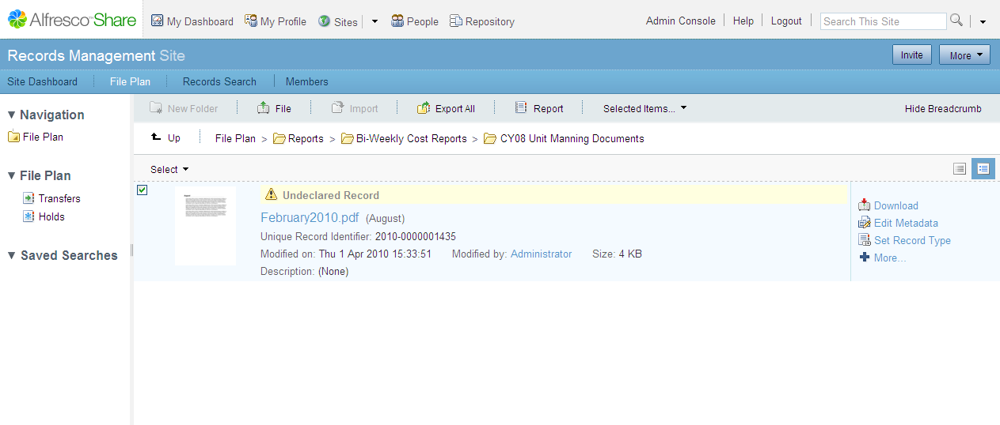
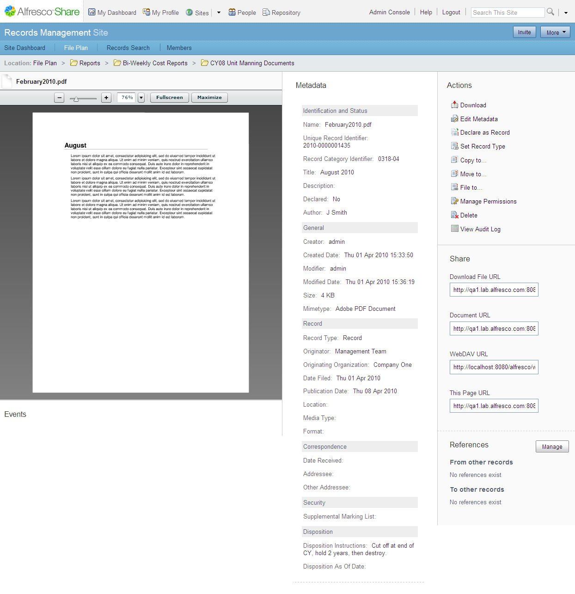

# Editing metadata

Records have mandatory metadata. You must complete the mandatory metadata before you can declare a record.

To edit the metadata:

1.  Navigate to the undeclared record in the File Plan.

2.  Position the cursor over the undeclared record to view the actions list.

    Undeclared records are identified with the an Undeclared Record label.

    

3.  Click **Edit Metadata** from the actions list.

    The Edit Metadata page displays.

4.  Enter the metadata details.

    An asterisk next to the metadata name indicates that the metadata is mandatory and you must enter text or a value in the field.

    1.  **Name**: Type a name for the record. This field is populated with the name of the file that was uploaded.

    2.  **Unique Record Identifier**: This is a unique identifier for each record. The system generates this identifier.

    3.  **Title**: Type the secondary title of this record.

    4.  **Description**: Type a short description of the record.

    5.  **Author**: Type the name or names of the document author.

    6.  **MIMEtype**: Type the MIME type of the uploaded file. Select a MIME type from the drop down list.

    7.  **Originator**: Type the person or department in the Originating Organization.

    8.  **Originating Organization**: Type the person or organization who created the document/record.

        For example, this may be the organization running the software or an external organization.

    9.  **Publication date**: Type the date that the record is published. Select the date from the calendar selection box.

    10. **Location**: Type the location of the record. This metadata field is mainly applicable to non-electronic.

        An example location is “Box 27661, Shelf D1, Deep Store Archive”.

    11. **Media Type**: Type the media.

    12. **Format**: Type the media on which the record is stored.

        For example, electronic or physical file.

    13. **Date received**: Type the date that the record was received from the originator.

    14. **Addressee**: This metadata is relevant for email records. Type the email address of the originating organization to be used for correspondence.

    15. **Other Addressee**: This metadata is relevant for email records. Type the secondary recipients of the message \(CC\).

    16. **Supplemental Marking List**: Select an item from the list.

        This list is defined in the List of Values tool in the Management Console.

    **Note:** Some fields do not allow certain special characters. For example, Name does not allow the characters colon :, and slash /, and so on. If you enter a special character, you cannot save the settings and the **Save** button remains greyed out.

5.  Click **Save**.

You can then view the details view of the item. The item now has associated metadata applied to it; however, it is still not considered to be a record within the system.

When you have completed the metadata, you can declare the item as a record so that it will become part of the Records Management system.

**Parent topic:**[Declaring a record](../tasks/rm-gs-undeclared-records.md)

