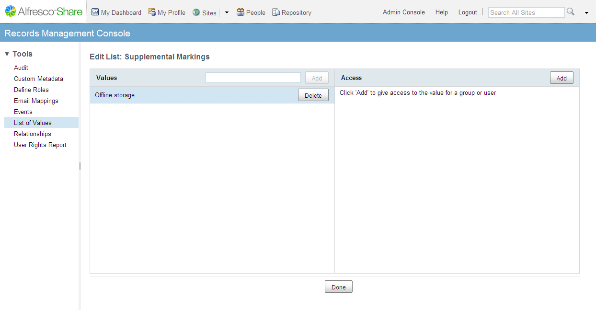

# Accessing list of values

1.  In the Records Management dashlet, click **Management Console**.

2.  Click the **List of Values** tool.

    The Lists page displays.

3.  Locate the Supplemental Markings list, and then click **Edit**.

    The Edit List: Supplemental Markings page displays.

4.  To add values to the list:

    1.  In the left column, type your value in the **Value** box.

        For example, type Offline storage.

    2.  Click **Add**.

        The value name displays in the list in the left column.

        

5.  To control the user and group access to the individual values in the list:

    1.  Click the **Offline storage**.

        When you have more than one value in the list, the selected value is highlighted in blue.

    2.  In the right column, click **Add**.

        The Add Access window displays.

    3.  Type a user name or group name to search.

        You must enter at least three characters in your search.

    4.  Click **Search**.

        The list of users and groups that match the search characters displays in the window.

    5.  Choose a user or group and click **Add**.

        The user or group displays in the right column.

6.  When you have finished editing the values and access, click **Done**.

**Parent topic:**[Managing lists of values](../concepts/rm-gs-lov.md)

