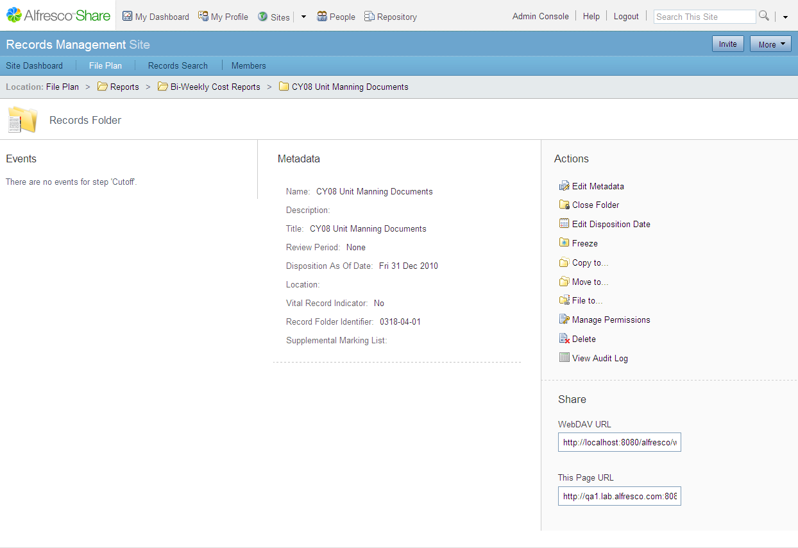

# Managing record folders

You can manage record folders within the File Plan, including viewing the full details, editing the metadata, closing the folder, managing permissions, and viewing the audit log for this folder.

1.  Navigate to the File Plan and click a record category name.

    The items list shows the available record folders within the category.

2.  In the items list, position the cursor over the record folder of interest to display the available actions.

3.  To view the details page for the folder, click **View Details**.

    The Details page displays the metadata and full list of actions.

    

4.  To view the metadata for the folder, click **Edit Metadata**.

5.  To close the folder, click **Close Folder**.

    An closed folder icon \(\)displays next to the folder name. A closed record folder cannot accept records for filing. When you close the folder, this action toggles to the **Re-open folder** action.

6.  To delete the folder, click **Delete**.

**Parent topic:**[Getting Started with Records Management](../concepts/rm-gs-intro.md)

