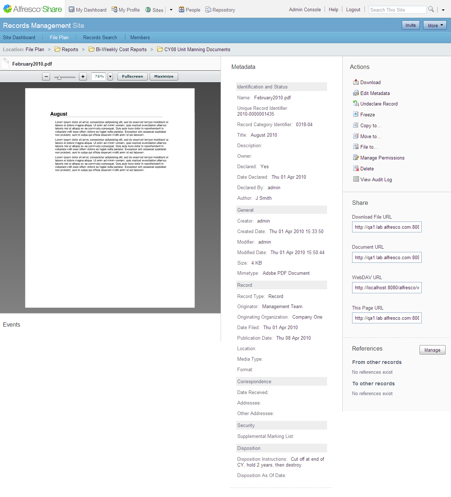

# Managing records

Each level in the File Plan structure provides appropriate actions for the record series, record category, record folder, and records. You can manage records within the File Plan, including viewing the full details, editing the metadata, managing permissions, and viewing the audit log for this record.

1.  Navigate to the File Plan and click a record folder name.

    The items list shows the available records within the folder.

2.  In the items list, to view the details page for the record, click the record name link.

    The Details page displays a preview of the record, the metadata, and full list of actions.

    

3.  To freeze the record, click **Freeze**.

    1.  Type a description for why you are freezing the record in the Reason for Freeze window.

    2.  Click **Freeze Record**.

    The **Freeze** action temporarily suspends some of the actions for this record. For example, you will not be able to manage permissions or undeclare the record.

    A frozen record icon \(\) displays next to the records name. The record also appears in the Holds space in the File Plan.

4.  To unfreeze the record, click **Unfreeze**.

5.  To manage the permissions for the record, click **Manage Permissions**.

    1.  Click **Add User or Group**.

    2.  Type the full or partial name of the user or group you want to find.

        You must enter a minimum of three \(3\) characters. The search is not case sensitive.

    3.  Click **Search**.

        The list of users and groups displays.

    4.  Select a user or group, and then click **Add**.

    5.  Select the permission from the **Permissions** menu.

    6.  Click **Done** when you have finished adding permissions.

    The record will only be available to the users or groups that you specify.

**Parent topic:**[Getting Started with Records Management](../concepts/rm-gs-intro.md)

