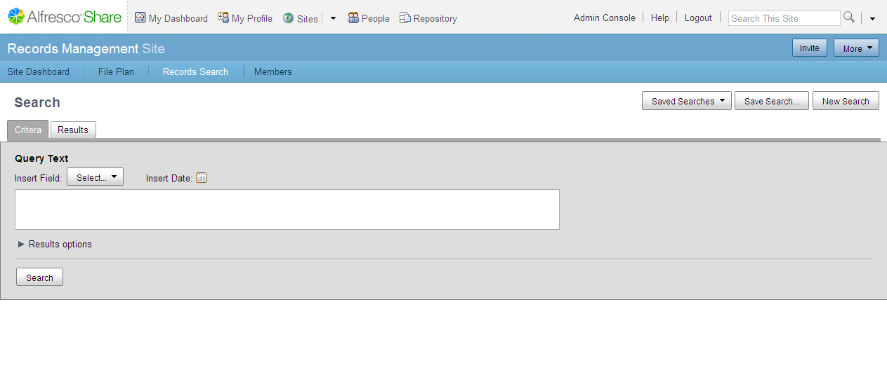

# Accessing Records Search

Accessing the records search enables you to create a search query to locate and view a list of records specified.

1.  Enter the Records Management site.

2.  On the banner, click **Records Search**.

    The Search page displays.

    

The Search page consists of two tabs: Criteria tab and Results tab. You enter use the Criteria tab to enter your search, and the search results are displayed in the Results tab.

-   **[Criteria tab](../concepts/rm-search-criteriatab.md)**  
Use the Criteria tab of the Search page to enter a search query to locate a list of specified records.
-   **[Results tab](../concepts/rm-search-resultstab.md)**  
Use the Results tab of the Search page to view the results of a search query.

**Parent topic:**[Searching for records](../tasks/rm-gs-search.md)

