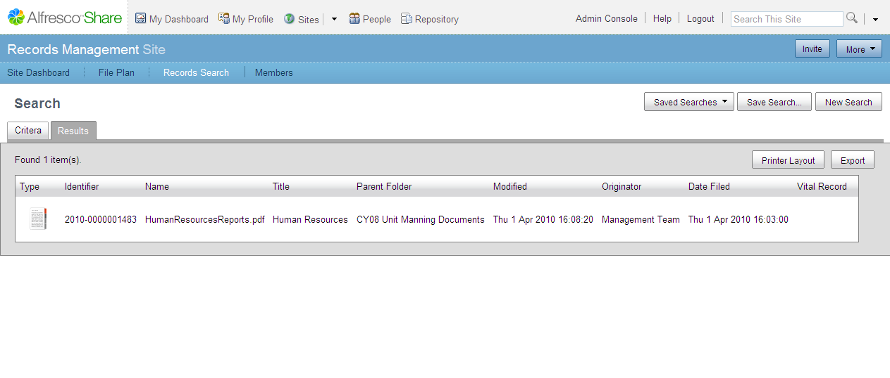

# Creating a simple search

This task assumes you are in the Search page.

The Search page provides two main areas: the **Query Text**area, where you enter your search criteria, and the **Results options** area, where you select options for how the results will be displayed.

1.  In the Query Text box, type a text string.

    For example, if you have uploaded records to the File Plan that contain recourses details, type resources.

2.  Click  Results options.

3.  Select the type of data that you want to return in the Results page.

    1.  In the **Metadata** area, select the metadata fields that you wish to display in the search results. The metadata name becomes a column title in the results table, which can then be sorted.

    2.  In the **Order** area, select the ordering of the search results.

    3.  In the **Components** area, select the type of components to search. For example, if you only want to search for the text in records, ensure that the **Records** check box is selected.

4.  Click **Search**.

    The search results display in a table in the Results tab.

    

To create a new search, click **New Search**. The Criteria tab clears for you to enter a new search query.

**Parent topic:**[Searching for records](../tasks/rm-gs-search.md)

