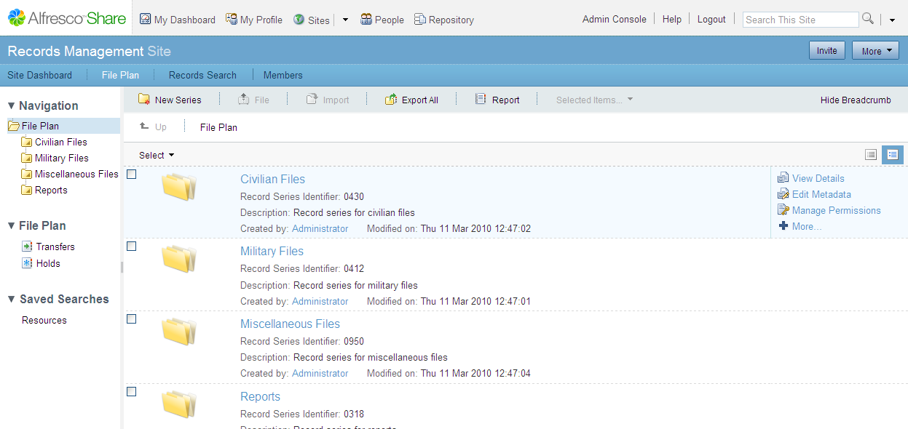

# Saving a search

This task assumes that you are in the Search page, viewing the results of a search query on the Results tab.

1.  Click **Save Search**.

2.  In the **Name** field, type a name for the search query.

3.  In the **Description** field, type a short explanation about what the search query returns.

4.  Click **Save**.

    The saved search query name displays in the **Saved Searches** menu. When you next return to Records Search, you will be able to select your saved search from the **Saved Searches** menu.

5.  In the banner, click **File Plan**.

    The saved search query name displays in the left navigation panel of the File Plan.

    For example, the following screen shot shows a saved search called **Resources**.

    

6.  Click on the saved search name in the File Plan.

    The results of the saved search display in the Search Results tab.

    **Note:** The saved search feature saves only the search query and not the results. This means that when you next use the saved search, you may get different results, depending on the activity in the Records Management system.

**Parent topic:**[Searching for records](../tasks/rm-gs-search.md)

